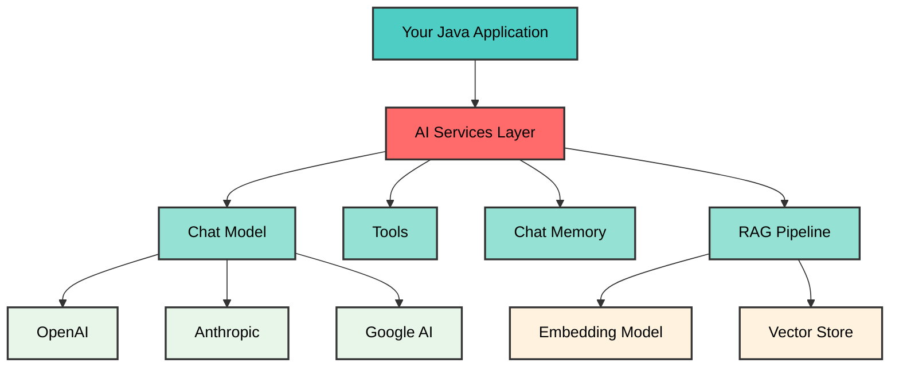
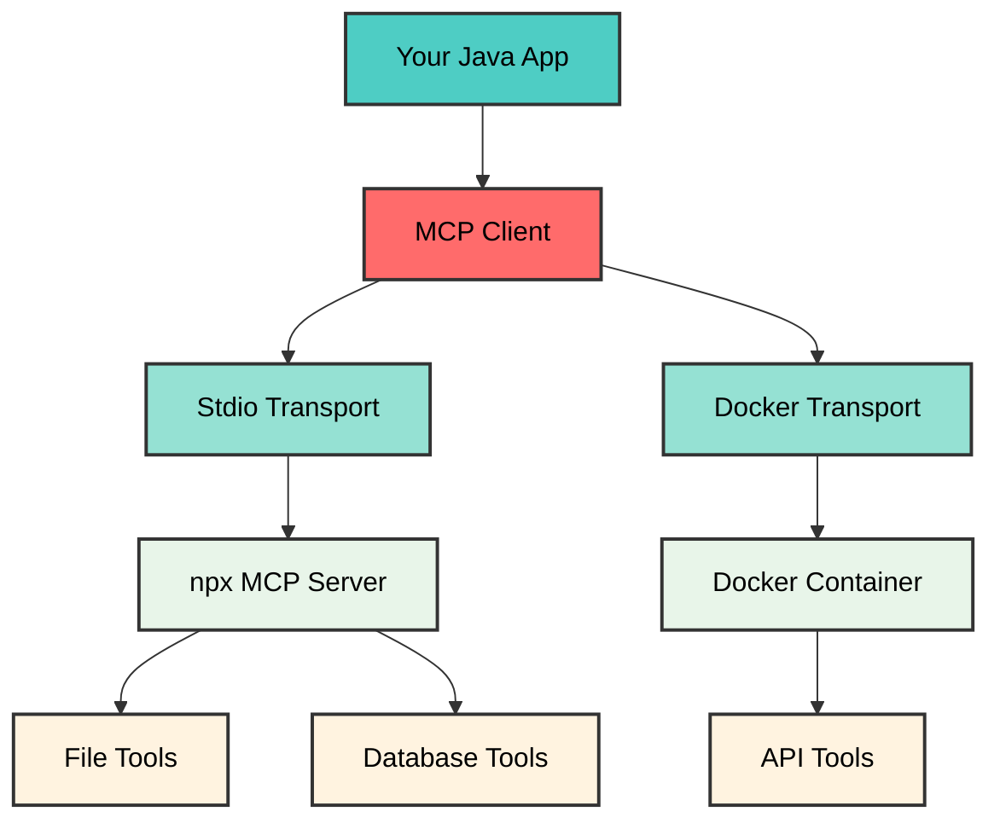

<style>
.slidev-page-num {
  display: block !important;
  opacity: 1 !important;
  visibility: visible !important;
  position: fixed !important;
  bottom: 1rem !important;
  right: 1rem !important;
  z-index: 100 !important;
  color: #666 !important;
  font-size: 0.875rem !important;
}
</style>

# LangChain4j 1.7.1 Training Course

## Building AI-Powered Java Applications

<div class="pt-12">
  <span @click="$slidev.nav.next" class="px-2 py-1 rounded cursor-pointer" hover="bg-white bg-opacity-10">
    Press Space for next page <carbon:arrow-right class="inline"/>
  </span>
</div>

---

# Contact Info

Ken Kousen
Kousen IT, Inc.

- ken.kousen@kousenit.com
- http://www.kousenit.com
- http://kousenit.org (blog)
- Social Media:
  - [@kenkousen](https://twitter.com/kenkousen) (twitter)
  - [@kenkousen@foojay.social](https://foojay.social/@kenkousen) (mastodon)
  - [@kousenit.com](https://bsky.app/profile/kousenit.com) (bluesky)
- *Tales from the jar side* (free newsletter)
  - https://kenkousen.substack.com
  - https://youtube.com/@talesfromthejarside

---

# Course Overview

## 5-Hour Hands-On Workshop

<v-clicks>

- LangChain4j fundamentals and architecture
- 10 progressive hands-on labs
- Real-world AI application patterns
- Production deployment strategies

</v-clicks>

---

# Topics We'll Cover

<v-clicks>

- Chat models and streaming responses
- Structured data extraction with AI
- AI Services and type-safe interfaces
- Chat memory and conversation management
- Tool calling and function integration
- Model Context Protocol (MCP)
- Multimodal capabilities (images, audio)
- Retrieval-Augmented Generation (RAG)
- Vector stores and embeddings
- Production best practices

</v-clicks>

---

# Prerequisites

<v-clicks>

- Java 17+ experience
- Basic understanding of AI/LLMs
- Gradle or Maven familiarity
- OpenAI API key (or alternative provider)
- IDE (IntelliJ IDEA recommended)

</v-clicks>

---

# What is LangChain4j?

## Java Library for Building LLM Applications

---
layout: two-cols
---

# Key Features

Core capabilities

::right::

<div class="space-y-3 text-sm">

<div v-click class="bg-blue-500 bg-opacity-20 p-2 rounded">
<strong>🤖 Multi-Model Support</strong>
<p class="text-xs mt-1">OpenAI, Anthropic, Google AI, and more</p>
</div>

<div v-click class="bg-green-500 bg-opacity-20 p-2 rounded">
<strong>💬 Chat & Memory</strong>
<p class="text-xs mt-1">Stateful conversations with context</p>
</div>

<div v-click class="bg-purple-500 bg-opacity-20 p-2 rounded">
<strong>🛠️ Tool Calling</strong>
<p class="text-xs mt-1">AI calls your Java methods</p>
</div>

<div v-click class="bg-orange-500 bg-opacity-20 p-2 rounded">
<strong>📚 RAG Support</strong>
<p class="text-xs mt-1">Augment AI with your data</p>
</div>

<div v-click class="bg-pink-500 bg-opacity-20 p-2 rounded">
<strong>🖼️ Multimodal</strong>
<p class="text-xs mt-1">Images, audio, and more</p>
</div>

</div>

---
layout: two-cols
---

# Why LangChain4j?

Java-native AI development

::right::

<div class="space-y-3 text-sm mt-4">

<div v-click class="bg-blue-500 bg-opacity-20 p-2 rounded">
<strong>☕ Native Java</strong>
<p class="text-xs mt-1">No Python required</p>
</div>

<div v-click class="bg-green-500 bg-opacity-20 p-2 rounded">
<strong>🔒 Type Safety</strong>
<p class="text-xs mt-1">Compile-time checks</p>
</div>

<div v-click class="bg-purple-500 bg-opacity-20 p-2 rounded">
<strong>🍃 Spring Boot</strong>
<p class="text-xs mt-1">First-class integration</p>
</div>

<div v-click class="bg-orange-500 bg-opacity-20 p-2 rounded">
<strong>🚀 Production Ready</strong>
<p class="text-xs mt-1">Battle-tested in production</p>
</div>

<div v-click class="bg-yellow-500 bg-opacity-20 p-2 rounded">
<strong>📖 Documentation</strong>
<p class="text-xs mt-1">Comprehensive guides</p>
</div>

</div>

---
layout: two-cols
---

# What's New in 1.7.1?

Core enhancements

::right::

<div class="space-y-4">

<div v-click class="bg-blue-500 bg-opacity-20 p-2 rounded">
<strong>🎯 Class-Based Agents</strong>
<p class="text-xs mt-1">Create agents from classes</p>
</div>

<div v-click class="bg-green-500 bg-opacity-20 p-2 rounded">
<strong>🗄️ ChromaDB API V2</strong>
<p class="text-xs mt-1">Enhanced vector store</p>
</div>

<div v-click class="bg-purple-500 bg-opacity-20 p-2 rounded">
<strong>🐳 Docker MCP Transport</strong>
<p class="text-xs mt-1">Containerized integration</p>
</div>

</div>

---
layout: two-cols
---

# What's New in 1.7.1?

Additional improvements

::right::

<div class="space-y-4">

<div v-click class="bg-orange-500 bg-opacity-20 p-2 rounded">
<strong>🤖 Enhanced Models</strong>
<p class="text-xs mt-1">OpenAI SDK v4.0, custom params</p>
</div>

<div v-click class="bg-yellow-500 bg-opacity-20 p-2 rounded">
<strong>📄 New Parsers</strong>
<p class="text-xs mt-1">YAML, Oracle, GPU support</p>
</div>

<div v-click class="bg-red-500 bg-opacity-20 p-2 rounded">
<strong>⚠️ HuggingFace Deprecated</strong>
<p class="text-xs mt-1">Use OpenAI/Anthropic/Google AI</p>
</div>

</div>

---

# LangChain4j Architecture



---

# Installation and Setup

Add LangChain4j to your project

```kotlin
// build.gradle.kts
dependencies {
    // BOM for version management
    implementation(platform("dev.langchain4j:langchain4j-bom:1.7.1"))

    // Core library
    implementation("dev.langchain4j:langchain4j")

    // Model integrations
    implementation("dev.langchain4j:langchain4j-open-ai")
    implementation("dev.langchain4j:langchain4j-anthropic")
    implementation("dev.langchain4j:langchain4j-google-ai-gemini")

    // Embeddings and RAG
    implementation("dev.langchain4j:langchain4j-embeddings-all-minilm-l6-v2")
    implementation("dev.langchain4j:langchain4j-chroma")
}
```

---

# Environment Setup

Configure API keys

```bash
# OpenAI
export OPENAI_API_KEY="your-openai-api-key"

# Anthropic (optional)
export ANTHROPIC_API_KEY="your-anthropic-api-key"

# Google AI (optional)
export GOOGLEAI_API_KEY="your-google-ai-key"
```

<div v-click class="mt-4 p-3 bg-yellow-500 bg-opacity-20 rounded text-sm">
⚠️ <strong>Security:</strong> Never commit API keys to version control
</div>

---

# Verify Installation

```bash
# Build the project
./gradlew build

# Run tests
./gradlew test
```

---
layout: image-right
image: https://images.unsplash.com/photo-1555949963-ff9fe0c870eb?w=1920
backgroundSize: cover
---

# Lab 1: Basic Chat

<div class="text-center mt-20">
  <h2 class="text-4xl font-bold text-white bg-black bg-opacity-60 px-6 py-3 rounded-lg">
    Getting Started
  </h2>
  <p class="text-xl text-white bg-black bg-opacity-60 px-4 py-2 rounded mt-4">
    Your first AI conversation
  </p>
</div>

---

# Lab 1.1: Simple Query

Basic chat interaction

```java {all|1-4|6-7|9-11|all}
@Test
void simpleQuery() {
    ChatModel model = OpenAiChatModel.builder()
            .apiKey(System.getenv("OPENAI_API_KEY"))
            .modelName(GPT_5_NANO)
            .build();

    String response = model.chat("Why is the sky blue?");

    System.out.println(response);
    assertNotNull(response);
    assertFalse(response.isEmpty());
}
```

---

# Lab 1.2: System Message

Control AI behavior

```java {all|1-2|4-5|7|all}
SystemMessage systemMessage = SystemMessage.from(
    "You are a helpful assistant that responds like a pirate.");

UserMessage userMessage = UserMessage.from(
    "Why is the sky blue?");

ChatResponse response = model.chat(systemMessage, userMessage);

System.out.println(response.aiMessage().text());
```

<div v-click class="mt-2 text-sm text-gray-400">
<p>🏴‍☠️ System messages shape AI personality</p>
</div>

---

# Lab 1.3: Response Metadata

Access token usage and costs

```java {all|1|3-4|all}
ChatResponse response = model.chat(userMessage);

System.out.println("Token Usage: " + response.tokenUsage());
System.out.println("Finish Reason: " + response.finishReason());
```

<div v-click class="mt-4 p-3 bg-blue-500 bg-opacity-20 rounded text-sm">
💡 <strong>Track tokens:</strong> Monitor costs and optimize prompts
</div>

---
layout: image-right
image: https://images.unsplash.com/photo-1555066931-4365d14bab8c?w=1920
backgroundSize: cover
---

# Lab 2: Streaming

<div class="text-center mt-20">
  <h2 class="text-4xl font-bold text-white bg-black bg-opacity-60 px-6 py-3 rounded-lg">
    Real-Time Responses
  </h2>
  <p class="text-xl text-white bg-black bg-opacity-60 px-4 py-2 rounded mt-4">
    Better user experience
  </p>
</div>

---

# Streaming Responses

Real-time AI responses for better user experience

```java {all|1-4|6-10|all}
@Test
void streamingChat() {
    StreamingChatModel model = OpenAiStreamingChatModel
        .builder()
        .apiKey(System.getenv("OPENAI_API_KEY"))
        .build();

    model.chat("Tell me a story",
        new StreamingChatResponseHandler() {
            public void onPartialResponse(String token) {
                System.out.print(token);
            }
            public void onCompleteResponse(ChatResponse r) {
                System.out.println("\nDone!");
            }
        });
}
```

<div v-click class="mt-4 text-sm text-gray-400">
<p>🌊 Real-time tokens</p>
<p>⚡ Better UX</p>
</div>

---

# Streaming with Context

Add system messages

```java {all|1-2|4-8|all}
SystemMessage systemMessage = SystemMessage.from(
    "You are a helpful coding assistant.");

model.chat(Arrays.asList(systemMessage, userMessage),
    new StreamingChatResponseHandler() {
        // Handler implementation
    });

latch.await(30, TimeUnit.SECONDS);
```

---
layout: image-right
image: https://images.unsplash.com/photo-1633356122544-f134324a6cee?w=1920
backgroundSize: cover
---

# Lab 3: Structured Data

<div class="text-center mt-20">
  <h2 class="text-4xl font-bold text-white bg-black bg-opacity-60 px-6 py-3 rounded-lg">
    Type-Safe Extraction
  </h2>
  <p class="text-xl text-white bg-black bg-opacity-60 px-4 py-2 rounded mt-4">
    Parse AI responses
  </p>
</div>

---

# Structured Data Extraction

Type-safe data parsing

```java {1-4|6-10|all}
record Person(String name, int age, String occupation) {}

interface PersonExtractor {
    @UserMessage("Extract: {{text}}")
    Person extractPerson(@V("text") String text);
}

PersonExtractor ex = AiServices.create(
    PersonExtractor.class, model);

Person p = ex.extractPerson(
    "John Doe is a 35-year-old engineer");
```

<div v-click class="mt-4 text-sm text-gray-400">
<p>💡 Returns: Person[name=John Doe, age=35, ...]</p>
</div>

---

# JSON Extraction

Manual parsing approach

```java {all|1-2|4-7|9-11|all}
ChatModel model = OpenAiChatModel.builder()
        .responseFormat("json_object")
        .build();

String prompt = """
    Generate JSON: {"actor": "Name", "movies": [...]}
    """;

String response = model.chat(prompt);
ObjectMapper mapper = new ObjectMapper();
ActorFilms data = mapper.readValue(response, ActorFilms.class);
```

---

# Multiple Entities

Extract collections

```java {1-2|4-8|all}
record ActorFilmographies(
    List<ActorFilms> filmographies) {}

interface ActorService {
    ActorFilmographies getMultipleActorFilmographies(
        @UserMessage String actors);
}

// Returns 3 actors with 4 movies each
ActorFilmographies result = service.getMultipleActorFilmographies(
    "Return 3 actors with 4 movies each");
```

---
layout: image-right
image: https://images.unsplash.com/photo-1551288049-bebda4e38f71?w=1920
backgroundSize: cover
---

# Lab 4: AI Services

<div class="text-center mt-20">
  <h2 class="text-4xl font-bold text-white bg-black bg-opacity-60 px-6 py-3 rounded-lg">
    High-Level APIs
  </h2>
  <p class="text-xl text-white bg-black bg-opacity-60 px-4 py-2 rounded mt-4">
    Type-safe AI integration
  </p>
</div>

---

# AI Services Interface

High-level type-safe AI interactions

```java {all|1-4|6-10|all}
interface FilmographyService {
    @SystemMessage("Movie expert")
    List<String> getMovies(
        @UserMessage String actor);
}

FilmographyService service =
    AiServices.builder(FilmographyService.class)
        .chatModel(model)
        .build();

List<String> movies = service.getMovies("Tom Hanks");
```

<div v-click class="mt-4 text-sm text-gray-400">
<p>✨ Type-safe interfaces</p>
<p>✨ Annotation-driven</p>
</div>

---

# Service with Templates

Variable substitution

```java {all|1-3|5-8|all}
interface DocumentAnalyzer {
    @UserMessage("Analyze: {{content}}")
    String analyzeDocument(@V("content") String content);

    @UserMessage("Extract themes from: {{content}}")
    List<String> extractThemes(@V("content") String content);

    @UserMessage("Rate sentiment 1-10: {{content}}")
    int analyzeSentiment(@V("content") String content);
}
```

---

# Service with Memory and Tools

Combine features

```java {all|1-2|4-8|10-11|all}
interface PersonalAssistant {
    String chat(String message);
}

PersonalAssistant assistant = AiServices.builder(PersonalAssistant.class)
    .chatModel(model)
    .chatMemory(MessageWindowChatMemory.withMaxMessages(10))
    .tools(new DateTimeTool())
    .build();

String response = assistant.chat("What's my name and the year in 3 years?");
```

---
layout: image-right
image: https://images.unsplash.com/photo-1559827260-dc66d52bef19?w=1920
backgroundSize: cover
---

# Lab 5: Chat Memory

<div class="text-center mt-20">
  <h2 class="text-4xl font-bold text-white bg-black bg-opacity-60 px-6 py-3 rounded-lg">
    Stateful Conversations
  </h2>
  <p class="text-xl text-white bg-black bg-opacity-60 px-4 py-2 rounded mt-4">
    Context management
  </p>
</div>

---
layout: two-cols
---

# Chat Memory

Single user conversation

::right::

```java {all|1-3|5-9|all}
interface Assistant {
    String chat(String message);
}

var assistant = AiServices.builder(Assistant.class)
    .chatModel(model)
    .chatMemory(MessageWindowChatMemory
        .withMaxMessages(10))
    .build();

assistant.chat("My name is Alice");
assistant.chat("What's my name?");
// Response: "Your name is Alice"
```

---
layout: two-cols
---

# Chat Memory

Multi-user conversations

::right::

```java {all|1-4|6-10|all}
interface MultiUserAssistant {
    String chat(@MemoryId int userId,
                @UserMessage String msg);
}

var assistant = AiServices.builder(...)
    .chatMemoryProvider(memoryId ->
        MessageWindowChatMemory
            .withMaxMessages(10))
    .build();

assistant.chat(1, "I'm Alice");
assistant.chat(2, "I'm Bob");
```

---

# Memory Types

Different memory strategies

```java
// Message window - limit by count
ChatMemory messageMemory =
    MessageWindowChatMemory.withMaxMessages(10);

// Token window - limit by tokens
ChatMemory tokenMemory =
    TokenWindowChatMemory.withMaxTokens(
        1000,
        new OpenAiTokenizer(GPT_5_NANO)
    );
```

---

# Stateless vs Stateful

Understanding the difference

```java
// Stateless - no memory
ChatModel model = OpenAiChatModel.builder().build();
model.chat("My name is Alice");
model.chat("What's my name?");
// AI doesn't remember

// Stateful - with memory
ChatMemory memory = MessageWindowChatMemory.withMaxMessages(10);
memory.add(UserMessage.from("My name is Alice"));
ChatResponse response = model.chat(memory.messages());
// AI remembers
```

---
layout: image-right
image: https://images.unsplash.com/photo-1526374965328-7f61d4dc18c5?w=1920
backgroundSize: cover
---

# Lab 6: AI Tools

<div class="text-center mt-20">
  <h2 class="text-4xl font-bold text-white bg-black bg-opacity-60 px-6 py-3 rounded-lg">
    Function Calling
  </h2>
  <p class="text-xl text-white bg-black bg-opacity-60 px-4 py-2 rounded mt-4">
    AI calls your code
  </p>
</div>

---

# AI Tools (Function Calling)

Let AI call your Java methods

```java {1-6|8-12|all}
class WeatherTool {
    @Tool("Get current weather")
    String getWeather(String location) {
        return "Weather in " + location +
               ": 72°F, sunny";
    }
}

var assistant = AiServices.builder(Assistant.class)
    .chatModel(model)
    .tools(new WeatherTool())
    .build();

assistant.chat("What's the weather in NYC?");
```

---

# Tool Examples

DateTimeTool implementation

```java
class DateTimeTool {
    @Tool("Get the current date and time")
    public String getCurrentDateTime() {
        return LocalDateTime.now()
            .format(DateTimeFormatter.ofPattern("yyyy-MM-dd HH:mm:ss"));
    }

    @Tool("Get date N years from now")
    public String getDateYearsFromNow(int years) {
        return LocalDate.now().plusYears(years).toString();
    }

    @Tool("Set an alarm")
    public String setAlarm(String time) {
        return "Alarm set for " + time;
    }
}
```

---

# Multiple Tools

Combine tool capabilities

```java
Assistant assistant = AiServices.builder(Assistant.class)
    .chatModel(model)
    .tools(
        new DateTimeTool(),
        new WeatherTool(),
        new CalculatorTool()
    )
    .build();

String response = assistant.chat(
    "What's 15 * 8, and what year is it in 3 years?"
);
```

---

# Tool Parameters

Complex parameters

```java
class CalculatorTool {
    @Tool("Add two numbers")
    public double add(double a, double b) {
        return a + b;
    }

    @Tool("Divide first by second")
    public double divide(double a, double b) {
        if (b == 0) {
            throw new IllegalArgumentException("Cannot divide by zero");
        }
        return a / b;
    }
}
```

---
layout: image-right
image: https://images.unsplash.com/photo-1544197150-b99a580bb7a8?w=1920
backgroundSize: cover
---

# Lab 6.5: MCP Integration

<div class="text-center mt-20">
  <h2 class="text-4xl font-bold text-white bg-black bg-opacity-60 px-6 py-3 rounded-lg">
    External Tools
  </h2>
  <p class="text-xl text-white bg-black bg-opacity-60 px-4 py-2 rounded mt-4">
    Model Context Protocol
  </p>
</div>

---

# MCP Integration

External tool protocol

```java {all|1-5|7-11|all}
// MCP client (stdio)
McpTransport transport =
    new StdioMcpTransport.Builder()
        .command(List.of("npx", "-y",
            "@modelcontextprotocol/server-everything"))
        .build();

// Use with AI
McpToolProvider tools = McpToolProvider.builder()
    .mcpClients(new DefaultMcpClient.Builder()
        .transport(transport).build())
    .build();

Assistant ai = AiServices.builder(Assistant.class)
    .toolProvider(tools).build();
```

<div v-click class="mt-2 text-sm text-gray-400">
<p>🐳 Docker transport in 1.7.1</p>
</div>

---

# MCP Architecture



---

# MCP with Local Tools

Hybrid approach

```java
// Combine local and external tools
Assistant assistant = AiServices.builder(Assistant.class)
    .chatModel(model)
    .tools(new DateTimeTool())  // Local tool
    .toolProvider(mcpToolProvider)  // External tools
    .build();

// AI can use both tool types
String response = assistant.chat(
    "What's the date in 5 years and fetch the weather data?"
);
```

---

# Docker MCP Transport (NEW)

Containerized MCP servers

```java
// NEW in 1.7.1 - Docker transport
McpTransport dockerTransport = new DockerMcpTransport.Builder()
    .image("mcp-server:latest")
    .build();

McpClient dockerClient = new DefaultMcpClient.Builder()
    .transport(dockerTransport)
    .build();

McpToolProvider toolProvider = McpToolProvider.builder()
    .mcpClients(dockerClient)
    .build();
```

---
layout: image-right
image: https://images.unsplash.com/photo-1633356122544-f134324a6cee?w=1920
backgroundSize: cover
---

# Lab 7: Multimodal

<div class="text-center mt-20">
  <h2 class="text-4xl font-bold text-white bg-black bg-opacity-60 px-6 py-3 rounded-lg">
    Images & Audio
  </h2>
  <p class="text-xl text-white bg-black bg-opacity-60 px-4 py-2 rounded mt-4">
    Beyond text
  </p>
</div>

---

# Multimodal: Images

Process images with AI

```java {all|1-3|5-9|all}
// Vision model
ChatModel model = OpenAiChatModel.builder()
    .modelName(GPT_5)
    .build();

// Analyze image
ImageContent img = ImageContent.from(imageString, "image/jpeg");
TextContent txt = TextContent.from("What do you see?");
UserMessage msg = UserMessage.from(txt, img);

String response = model.chat(msg).aiMessage().text();
```

<div v-click class="mt-2 text-sm text-gray-400">
<p>🖼️ GPT-5 for vision</p>
</div>

---

# Image from URL

Remote image analysis

```java
// Use public URL
String imageUrl = "https://example.com/image.jpg";

ImageContent imageContent = ImageContent.from(imageUrl);
TextContent textContent = TextContent.from(
    "Describe this landscape in detail"
);

UserMessage message = UserMessage.from(textContent, imageContent);
String analysis = model.chat(message).aiMessage().text();
```

---

# Structured Image Analysis

Extract structured data from images

```java {all|1-6|8-12|all}
interface DetailedAnalyst {
    @UserMessage("Analyze image: {{image}}")
    ImageAnalysisResult analyzeComprehensively(
        @V("image") ImageContent image
    );
}

record ImageAnalysisResult(
    String description,
    List<String> objects,
    List<String> colors,
    String mood
) {}

DetailedAnalyst analyst = AiServices.builder(DetailedAnalyst.class)
    .chatModel(model)
    .build();
```

---

# Multimodal: Audio

Speech-to-text with Gemini

```java {all|1-4|6-10|all}
// Gemini for audio
ChatModel model = GoogleAiGeminiChatModel.builder()
    .apiKey(System.getenv("GOOGLEAI_API_KEY"))
    .modelName("gemini-2.5-flash-preview-05-20")
    .build();

// Transcribe audio
AudioContent audio = AudioContent.from(
    readAudioData(), "audio/mp3");
UserMessage msg = UserMessage.from(
    TextContent.from("Transcribe:"), audio);

String text = model.chat(msg).aiMessage().text();
```

<div v-click class="mt-2 text-sm text-gray-400">
<p>🎵 MP3, WAV support</p>
</div>

---
layout: image-right
image: https://images.unsplash.com/photo-1618005182384-a83a8bd57fbe?w=1920
backgroundSize: cover
---

# Lab 8: Image Generation

<div class="text-center mt-20">
  <h2 class="text-4xl font-bold text-white bg-black bg-opacity-60 px-6 py-3 rounded-lg">
    Create Images
  </h2>
  <p class="text-xl text-white bg-black bg-opacity-60 px-4 py-2 rounded mt-4">
    DALL-E integration
  </p>
</div>

---

# Image Generation

Create images with DALL-E

```java {all|1-4|6-9|all}
// DALL-E model
ImageModel imageModel = OpenAiImageModel.builder()
    .modelName(DALL_E_3)
    .quality("hd")
    .build();

// Generate from prompt
Response<Image> response = imageModel.generate(
    "A coffee cup on a desk, photorealistic");

Image img = response.content();
String url = img.url();
```

<div v-click class="mt-2 text-sm text-gray-400">
<p>🎨 DALL-E 3 support</p>
</div>

---

# Image Generation Options

Configure quality and style

```java
ImageModel model = OpenAiImageModel.builder()
    .apiKey(System.getenv("OPENAI_API_KEY"))
    .modelName(DALL_E_3)
    .size("1024x1024")
    .quality("hd")         // "standard" or "hd"
    .style("vivid")        // "vivid" or "natural"
    .build();

String prompt = "A futuristic cityscape at dawn with flying vehicles";
Response<Image> response = model.generate(prompt);
```

---

# Base64 Image Generation

Using gpt-image-1 model

```java
ImageModel model = OpenAiImageModel.builder()
    .modelName("gpt-image-1")
    .build();

Response<Image> response = model.generate("A warrior cat rides a dragon");
Image image = response.content();

// Get base64 data
byte[] imageBytes = Base64.getDecoder().decode(image.base64Data());

// Save to file
Path outputPath = Path.of("src/main/resources/generated_image.png");
Files.write(outputPath, imageBytes);
```

---

# Creative Variations

Generate multiple images

```java
String[] prompts = {
    "A steampunk robot playing chess",
    "A minimalist abstract representation of music",
    "A cozy library in a treehouse"
};

for (String prompt : prompts) {
    Response<Image> response = model.generate(prompt);
    Image image = response.content();

    System.out.println("Generated: " + image.url());
    System.out.println("Revised: " + image.revisedPrompt());
}
```

---
layout: image-right
image: https://images.unsplash.com/photo-1507842217343-583bb7270b66?w=1920
backgroundSize: cover
---

# Lab 9: RAG Basics

<div class="text-center mt-20">
  <h2 class="text-4xl font-bold text-white bg-black bg-opacity-60 px-6 py-3 rounded-lg">
    Knowledge Augmentation
  </h2>
  <p class="text-xl text-white bg-black bg-opacity-60 px-4 py-2 rounded mt-4">
    AI + your data
  </p>
</div>

---

# RAG Implementation

```java {1-4|6-10|12-16|all}
// Setup embedding model and store
EmbeddingModel embeddingModel =
    new AllMiniLmL6V2QuantizedEmbeddingModel();
EmbeddingStore<TextSegment> store =
    new InMemoryEmbeddingStore<>();

// Load and split documents
Document doc = FileSystemDocumentLoader.loadDocument(
    Paths.get("knowledge-base.pdf"));
List<TextSegment> segments =
    DocumentSplitters.recursive(300, 50).split(doc);

// Create RAG assistant
Assistant assistant = AiServices.builder(Assistant.class)
    .chatModel(model)
    .contentRetriever(
        EmbeddingStoreContentRetriever.from(store))
    .build();
```

---

# RAG Architecture

```mermaid
graph LR
    Query[User Query] --> Embed[Embed Query]
    Embed --> Search[Vector Search]
    Search --> Store[(Vector Store)]
    Store --> Retrieve[Retrieved Docs]
    Retrieve --> Augment[Augment Prompt]
    Augment --> LLM[LLM]
    LLM --> Response[Response]

    style Query fill:#4ECDC4,stroke:#333,stroke-width:2px,color:#000
    style Embed fill:#E8F5E9,stroke:#333,stroke-width:2px,color:#000
    style Search fill:#E8F5E9,stroke:#333,stroke-width:2px,color:#000
    style Store fill:#FF6B6B,stroke:#333,stroke-width:2px,color:#000
    style Retrieve fill:#E8F5E9,stroke:#333,stroke-width:2px,color:#000
    style Augment fill:#FFF3E0,stroke:#333,stroke-width:2px,color:#000
    style LLM fill:#95E1D3,stroke:#333,stroke-width:2px,color:#000
    style Response fill:#4ECDC4,stroke:#333,stroke-width:2px,color:#000
```



---

# Document Loading

Load from various sources

```java
// From file system
Document doc = FileSystemDocumentLoader.loadDocument(
    Paths.get("document.pdf")
);

// From URL
Document webDoc = UrlDocumentLoader.load(
    new URL("https://example.com/docs")
);

// Create from string
Document textDoc = Document.from("Sample content");
```

---

# Document Splitting

Chunk documents for embeddings

```java
// Recursive splitter
DocumentSplitter splitter = DocumentSplitters.recursive(
    300,  // Max chunk size
    50    // Overlap
);

// Character splitter
DocumentSplitter charSplitter = DocumentSplitters.character(
    500,
    100
);

// Sentence splitter
DocumentSplitter sentenceSplitter = DocumentSplitters.sentence(
    10  // Max sentences per chunk
);
```

---

# Embedding and Storage

Store document embeddings

```java
// Embed documents
List<Embedding> embeddings = embeddingModel.embedAll(segments).content();

// Store embeddings with segments
embeddingStore.addAll(embeddings, segments);

// Query with embedding
Embedding queryEmbedding = embeddingModel.embed("search query").content();

List<EmbeddingMatch<TextSegment>> matches = embeddingStore.search(
    EmbeddingSearchRequest.builder()
        .queryEmbedding(queryEmbedding)
        .maxResults(5)
        .minScore(0.7)
        .build()
).matches();
```

---

# RAG with Metadata

Add context to documents

```java
Document doc = Document.from("Java was created by James Gosling")
    .toBuilder()
    .metadata("language", "java")
    .metadata("topic", "history")
    .metadata("created_at", LocalDateTime.now().toString())
    .build();

// Use metadata in retrieval
ContentRetriever retriever = EmbeddingStoreContentRetriever.builder()
    .embeddingStore(store)
    .embeddingModel(embeddingModel)
    .maxResults(3)
    .minScore(0.6)
    .build();
```

---
layout: image-right
image: https://images.unsplash.com/photo-1558494949-ef010cbdcc31?w=1920
backgroundSize: cover
---

# Lab 10: Vector Stores

<div class="text-center mt-20">
  <h2 class="text-4xl font-bold text-white bg-black bg-opacity-60 px-6 py-3 rounded-lg">
    Production RAG
  </h2>
  <p class="text-xl text-white bg-black bg-opacity-60 px-4 py-2 rounded mt-4">
    ChromaDB integration
  </p>
</div>

---

# ChromaDB (API V2)

Production vector store

```java {all|1-4|6-9|11-14|all}
// ChromaDB with API V2 support (1.7.1)
EmbeddingStore<TextSegment> store =
    ChromaEmbeddingStore.builder()
        .baseUrl("http://localhost:8000")
        .collectionName(randomUUID())
        .build();

// Process and store
List<TextSegment> segments = splitDocuments(docs);
List<Embedding> embeddings =
    embeddingModel.embedAll(segments).content();
store.addAll(embeddings, segments);

// Semantic search
List<EmbeddingMatch<TextSegment>> matches =
    store.search(EmbeddingSearchRequest.builder()
        .queryEmbedding(queryEmbedding)
        .maxResults(5).build()).matches();
```

<div v-click class="mt-2 text-sm text-gray-400">
<p>🚀 API V2: Better performance</p>
</div>

---

# ChromaDB Setup

Start ChromaDB server

```bash
# Docker (recommended)
docker run -p 8000:8000 chromadb/chroma:0.5.4

# Verify connection
curl http://localhost:8000/api/v1/heartbeat
```

<div v-click class="mt-4 p-3 bg-blue-500 bg-opacity-20 rounded text-sm">
💡 <strong>API V2:</strong> LangChain4j 1.7.1 supports ChromaDB API V2 for enhanced performance
</div>

---

# Production RAG System

Complete implementation

```java {all|1-5|7-12|14-20|all}
// Configure with production settings
ChatModel chatModel = OpenAiChatModel.builder()
    .apiKey(System.getenv("OPENAI_API_KEY"))
    .modelName(GPT_5_NANO)
    .build();

EmbeddingStore<TextSegment> store = ChromaEmbeddingStore.builder()
    .baseUrl("http://localhost:8000")
    .collectionName(randomUUID())
    .logRequests(true)
    .build();

// Add metadata for production
segment.metadata().put("source", "docs");
segment.metadata().put("created_at", LocalDateTime.now().toString());

ContentRetriever retriever = EmbeddingStoreContentRetriever.builder()
    .embeddingStore(store)
    .maxResults(3)
    .minScore(0.6)
    .build();
```

---

# RAG with Document Parsing

PDF processing with Apache Tika

```java
// Load PDF document
Path documentPath = Paths.get("src/test/resources/document.pdf");
Document document = FileSystemDocumentLoader.loadDocument(documentPath);

// Split with metadata
DocumentSplitter splitter = DocumentSplitters.recursive(300, 50);
List<TextSegment> segments = splitter.split(document);

for (int i = 0; i < segments.size(); i++) {
    TextSegment segment = segments.get(i);
    segment.metadata().put("chunk_id", String.valueOf(i));
    segment.metadata().put("source_file", "document.pdf");
    segment.metadata().put("document_type", "pdf");
}
```

---

# Vector Store Comparison

Different storage options

<div class="grid grid-cols-2 gap-4 text-sm">

<div>

### In-Memory
```java
new InMemoryEmbeddingStore<>();
```
- ✅ Fast
- ✅ Simple
- ❌ No persistence
- ❌ Limited scale

</div>

<div>

### ChromaDB
```java
ChromaEmbeddingStore.builder()
    .baseUrl("http://localhost:8000")
    .build();
```
- ✅ Persistent
- ✅ Scalable
- ✅ Production-ready
- ✅ API V2 support

</div>

</div>

---
layout: image-right
image: https://images.unsplash.com/photo-1516321318423-f06f85e504b3?w=1920
backgroundSize: cover
---

# Best Practices

<div class="text-center mt-20">
  <h2 class="text-4xl font-bold text-white bg-black bg-opacity-60 px-6 py-3 rounded-lg">
    Production Patterns
  </h2>
  <p class="text-xl text-white bg-black bg-opacity-60 px-4 py-2 rounded mt-4">
    Enterprise-ready code
  </p>
</div>

---

# Error Handling

Robust error management

```java
try {
    String response = model.chat(prompt);
    return response;
} catch (Exception e) {
    log.error("AI call failed: {}", e.getMessage());
    // Fallback strategy
    return getDefaultResponse();
}

// With retries
Retry retry = Retry.ofDefaults("aiService");
String response = retry.executeSupplier(() ->
    model.chat(prompt)
);
```

---

# Token Management

Monitor and control costs

```java
ChatModel model = OpenAiChatModel.builder()
    .apiKey(System.getenv("OPENAI_API_KEY"))
    .maxTokens(500)  // Limit response size
    .build();

// Track usage
ChatResponse response = model.chat(userMessage);
TokenUsage usage = response.tokenUsage();

log.info("Input tokens: {}", usage.inputTokenCount());
log.info("Output tokens: {}", usage.outputTokenCount());
log.info("Total tokens: {}", usage.totalTokenCount());
```

---

# Prompt Engineering

Effective prompts

```java
@SystemMessage("""
    You are an expert Java developer assistant.
    Provide accurate, concise answers.
    Use code examples when appropriate.
    If uncertain, clearly state limitations.
    """)
interface JavaAssistant {
    @UserMessage("""
        Task: {{task}}
        Context: {{context}}
        Requirements: {{requirements}}

        Provide a detailed solution.
        """)
    String solveTask(
        @V("task") String task,
        @V("context") String context,
        @V("requirements") String requirements
    );
}
```

---

# Testing AI Services

Unit and integration tests

```java
@Test
void testAiServiceResponse() {
    // Use test model with fixed responses
    ChatModel mockModel = mock(ChatModel.class);
    when(mockModel.chat(any(String.class)))
        .thenReturn("Expected response");

    MyService service = AiServices.builder(MyService.class)
        .chatModel(mockModel)
        .build();

    String result = service.process("test input");

    assertThat(result).contains("Expected response");
    verify(mockModel, times(1)).chat(any(String.class));
}
```

---

# Production Configuration

Environment-based settings

```java
@Configuration
public class AiConfig {

    @Bean
    @Profile("production")
    public ChatModel productionModel() {
        return OpenAiChatModel.builder()
            .apiKey(System.getenv("OPENAI_API_KEY"))
            .modelName(GPT_5_NANO)
            .maxRetries(3)
            .timeout(Duration.ofSeconds(30))
            .build();
    }

    @Bean
    @Profile("development")
    public ChatModel devModel() {
        return OpenAiChatModel.builder()
            .modelName(GPT_5)
            .build();
    }
}
```

---

# Caching Strategies

Reduce costs with caching

```java
@Cacheable("ai-responses")
public String getCachedResponse(String prompt) {
    return model.chat(prompt);
}

// Redis cache configuration
@Bean
public CacheManager cacheManager(RedisConnectionFactory factory) {
    return RedisCacheManager.builder(factory)
        .cacheDefaults(
            RedisCacheConfiguration.defaultCacheConfig()
                .entryTtl(Duration.ofHours(24))
        )
        .build();
}
```

---

# Security Best Practices

Protect sensitive data

<v-clicks>

- **Never log API keys** - Use environment variables
- **Sanitize inputs** - Validate and escape user input
- **Rate limiting** - Prevent abuse
- **API key rotation** - Regular updates
- **Audit logging** - Track AI usage
- **Content filtering** - Block inappropriate content

</v-clicks>

---

# Monitoring and Observability

Track AI performance

```java
@Aspect
@Component
public class AiMonitoringAspect {

    @Around("@annotation(Tool)")
    public Object monitorToolExecution(ProceedingJoinPoint pjp) {
        long startTime = System.currentTimeMillis();
        try {
            Object result = pjp.proceed();
            long duration = System.currentTimeMillis() - startTime;

            metrics.recordToolExecution(
                pjp.getSignature().getName(),
                duration,
                "success"
            );
            return result;
        } catch (Throwable e) {
            metrics.recordToolExecution(
                pjp.getSignature().getName(),
                System.currentTimeMillis() - startTime,
                "error"
            );
            throw e;
        }
    }
}
```

---

# Production Considerations

<div class="grid grid-cols-2 gap-6 text-sm">

<div v-click class="bg-blue-500 bg-opacity-20 p-3 rounded">
<strong>🔒 Security</strong>
<ul class="text-xs mt-1">
<li>• API key management</li>
<li>• Input validation</li>
<li>• Rate limiting</li>
</ul>
</div>

<div v-click class="bg-green-500 bg-opacity-20 p-3 rounded">
<strong>📊 Monitoring</strong>
<ul class="text-xs mt-1">
<li>• Token usage tracking</li>
<li>• Error rates</li>
<li>• Response times</li>
</ul>
</div>

<div v-click class="bg-purple-500 bg-opacity-20 p-3 rounded">
<strong>⚡ Performance</strong>
<ul class="text-xs mt-1">
<li>• Caching strategies</li>
<li>• Connection pooling</li>
<li>• Async processing</li>
</ul>
</div>

<div v-click class="bg-orange-500 bg-opacity-20 p-3 rounded">
<strong>🧪 Testing</strong>
<ul class="text-xs mt-1">
<li>• Mock AI services</li>
<li>• Integration tests</li>
<li>• Load testing</li>
</ul>
</div>

</div>

---

# Spring Boot Integration

Native framework support

```java
@RestController
@RequestMapping("/api/chat")
public class ChatController {

    private final Assistant assistant;

    @Autowired
    public ChatController(ChatModel model, ChatMemory memory) {
        this.assistant = AiServices.builder(Assistant.class)
            .chatModel(model)
            .chatMemory(memory)
            .build();
    }

    @PostMapping
    public String chat(@RequestBody ChatRequest request) {
        return assistant.chat(request.getMessage());
    }
}
```

---

# Spring Boot Configuration

Auto-configuration

```yaml
# application.yml
langchain4j:
  open-ai:
    chat-model:
      api-key: ${OPENAI_API_KEY}
      model-name: gpt-4o-mini
      temperature: 0.7
      max-tokens: 1000

  embedding-model:
    all-mini-lm-l6-v2:
      enabled: true
```

---

# Lab Progression

10 hands-on labs

<div class="space-y-3 text-sm mt-4">

<div v-click class="bg-blue-500 bg-opacity-20 p-2 rounded">
<strong>🚀 Foundation</strong>
<p class="text-xs">Labs 1-3: Chat, Streaming, Extraction</p>
</div>

<div v-click class="bg-green-500 bg-opacity-20 p-2 rounded">
<strong>🧠 Services & Memory</strong>
<p class="text-xs">Labs 4-5: AI Services, Chat Memory</p>
</div>

<div v-click class="bg-purple-500 bg-opacity-20 p-2 rounded">
<strong>🛠️ Tools & Integration</strong>
<p class="text-xs">Labs 6-8: Function Calling, MCP, Multimodal</p>
</div>

<div v-click class="bg-orange-500 bg-opacity-20 p-2 rounded">
<strong>📚 RAG Implementation</strong>
<p class="text-xs">Labs 9-10: RAG, Vector Stores</p>
</div>

</div>

---

# Resources

Documentation and course materials

<div class="mt-4 space-y-4 text-sm">

<div v-click class="bg-blue-500 bg-opacity-20 p-3 rounded">
<strong>📚 Documentation</strong>
<ul class="text-xs mt-1 space-y-1">
<li>• [LangChain4j Docs](https://docs.langchain4j.dev)</li>
<li>• [GitHub Repository](https://github.com/langchain4j/langchain4j)</li>
<li>• [Examples](https://github.com/langchain4j/langchain4j-examples)</li>
</ul>
</div>

<div v-click class="bg-green-500 bg-opacity-20 p-3 rounded">
<strong>🛠️ This Course (v1.7.1)</strong>
<ul class="text-xs mt-1 space-y-1">
<li>• Main branch: Starter code</li>
<li>• Solutions branch: Complete implementations</li>
<li>• Labs.md: Step-by-step guide</li>
<li>• UPGRADE_NOTES_1.7.1.md: What's new</li>
</ul>
</div>

</div>

---

# Best Practices

Tips for production use

<div class="mt-4 space-y-4 text-sm">

<div v-click class="bg-purple-500 bg-opacity-20 p-3 rounded">
<strong>🎯 Best Practices</strong>
<ul class="text-xs mt-1 space-y-1">
<li>• Use environment variables for API keys</li>
<li>• Implement proper error handling</li>
<li>• Monitor token usage</li>
<li>• Cache embeddings when possible</li>
<li>• Test with different models</li>
<li>• Use ChromaDB API V2 for production</li>
</ul>
</div>

<div v-click class="bg-orange-500 bg-opacity-20 p-3 rounded">
<strong>💡 Tips</strong>
<ul class="text-xs mt-1 space-y-1">
<li>• Start simple, iterate</li>
<li>• Read the JavaDocs</li>
<li>• Check the examples repo</li>
<li>• Join the community</li>
<li>• Explore class-based agents (1.7.1)</li>
<li>• Try Docker MCP transport</li>
</ul>
</div>

</div>

---

# Community & Support

### 📚 Official Resources
- [LangChain4j Documentation](https://docs.langchain4j.dev)
- [GitHub Repository](https://github.com/langchain4j/langchain4j)
- [Examples Repository](https://github.com/langchain4j/langchain4j-examples)

### 🆘 Getting Help
- [GitHub Discussions](https://github.com/langchain4j/langchain4j/discussions)
- [Discord Community](https://discord.gg/langchain4j)
- Stack Overflow: `langchain4j` tag

---

# Course Repository

### 💻 Training Materials
`https://github.com/kousen/langchain4j-training`

### 📖 Labs Documentation
All labs with starter code and solutions

### 🎯 Hands-On Exercises
Progressive learning path from basics to production

---

# Thank You!

<div class="text-center">

## Questions?

<div class="pt-12">
  <span class="text-6xl"><carbon:logo-github /></span>
</div>

**Kenneth Kousen**
*Author, Speaker, Java & AI Expert*

[kousenit.com](https://kousenit.com) | [@kenkousen](https://twitter.com/kenkousen)

</div>
