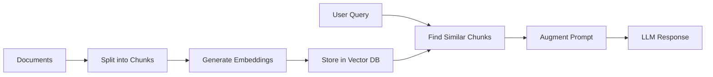

# LangChain4j 1.7.1 Training Course

Building AI-Powered Java Applications

<div class="pt-12">
  <span @click="$slidev.nav.next" class="px-2 py-1 rounded cursor-pointer hover:bg-white hover:bg-opacity-10">
    Press Space for next page <carbon:arrow-right class="inline"/>
  </span>
</div>

---
transition: fade-out
---

# What is LangChain4j?

LangChain4j 1.7.1 is a Java library for building applications with Large Language Models (LLMs)

<div class="grid grid-cols-2 gap-4">

<div>

## Key Features

- 🤖 **AI Model Integration** - OpenAI, Google AI, and more
- 💬 **Chat & Conversations** - With memory management
- 🛠️ **Tool Calling** - Connect AI to your Java methods
- 📚 **RAG Support** - Augment AI with your data
- 🌊 **Streaming** - Real-time AI responses
- 🖼️ **Multimodal** - Process images and audio

</div>

<div>

## Why LangChain4j?

- Native Java integration
- Type-safe builders
- Spring Boot support
- Production-ready
- Active community
- Extensive documentation

</div>

</div>

---
layout: two-cols
---

# What's New in 1.7.1?

Core enhancements

::right::

<div class="space-y-4">

<div v-click class="bg-blue-500 bg-opacity-20 p-3 rounded">
<strong>🎯 Class-Based Agents</strong>
<p class="text-xs mt-1">Create agents from classes</p>
</div>

<div v-click class="bg-green-500 bg-opacity-20 p-3 rounded">
<strong>🗄️ ChromaDB API V2</strong>
<p class="text-xs mt-1">Enhanced vector store</p>
</div>

<div v-click class="bg-purple-500 bg-opacity-20 p-3 rounded">
<strong>🐳 Docker MCP Transport</strong>
<p class="text-xs mt-1">Containerized integration</p>
</div>

</div>

---
layout: two-cols
---

# What's New in 1.7.1?

Additional improvements

::right::

<div class="space-y-4">

<div v-click class="bg-orange-500 bg-opacity-20 p-3 rounded">
<strong>🤖 Enhanced Models</strong>
<p class="text-xs mt-1">OpenAI SDK v4.0, custom params</p>
</div>

<div v-click class="bg-yellow-500 bg-opacity-20 p-3 rounded">
<strong>📄 New Parsers</strong>
<p class="text-xs mt-1">YAML, Oracle, GPU support</p>
</div>

<div v-click class="bg-red-500 bg-opacity-20 p-3 rounded">
<strong>⚠️ HuggingFace Deprecated</strong>
<p class="text-xs mt-1">Use OpenAI/Anthropic/Google AI</p>
</div>

</div>

---
layout: two-cols
---

# Simple Chat Example

Basic interaction with OpenAI's GPT model (LangChain4j 1.0+)

::right::

```java {all|3-5|7-9|11|all}
@Test
void simpleQuery() {
    ChatModel model = OpenAiChatModel.builder()
            .apiKey(System.getenv("OPENAI_API_KEY"))
            .modelName(GPT_4_1_NANO)
            .build();
    
    String response = model.chat(
        "What is LangChain4j?"
    );
    
    System.out.println(response);
    assertNotNull(response);
}
```

<div v-after class="text-sm mt-4 text-gray-400">
<p v-click="4">✨ ChatModel interface (LangChain4j 1.0+)</p>
<p v-click="5">✨ Simple chat() method</p>
<p v-click="6">✨ GPT_4_1_NANO constant</p>
</div>

---
layout: two-cols
---

# System Messages

Change AI behavior with system instructions

::right::

```java {all|1-5|7-10|12-16|all}
@Test
void simpleQueryWithSystemMessage() {
    ChatModel model = OpenAiChatModel.builder()
            .apiKey(System.getenv("OPENAI_API_KEY"))
            .modelName(GPT_4_1_NANO)
            .build();

    SystemMessage systemMessage = SystemMessage.from(
        "You are a helpful assistant that responds like a pirate."
    );
    UserMessage userMessage = UserMessage.from("Why is the sky blue?");

    ChatResponse response = model.chat(systemMessage, userMessage);

    System.out.println(response.aiMessage().text());
    assertNotNull(response.aiMessage().text());
}
```

<div v-click class="mt-4 p-3 bg-blue-500 bg-opacity-20 rounded text-sm">
💡 <strong>System messages</strong> control AI personality and behavior
</div>

---
layout: two-cols
---

# Streaming Responses

Real-time AI responses for better user experience

::right::

```java {all|1-4|6-10|all}
@Test
void streamingChat() {
    StreamingChatModel model = OpenAiStreamingChatModel
        .builder()
        .apiKey(System.getenv("OPENAI_API_KEY"))
        .build();

    model.chat("Tell me a story",
        new StreamingChatResponseHandler() {
            public void onPartialResponse(String token) {
                System.out.print(token);
            }
            public void onCompleteResponse(ChatResponse r) {
                System.out.println("\nDone!");
            }
        });
}
```

<div v-click class="mt-4 text-sm text-gray-400">
<p>🌊 Real-time tokens</p>
<p>⚡ Better UX</p>
</div>

---
layout: two-cols
---

# AI Services Interface

High-level type-safe AI interactions

::right::

```java {all|1-4|6-10|all}
interface FilmographyService {
    @SystemMessage("Movie expert")
    List<String> getMovies(
        @UserMessage String actor);
}

FilmographyService service =
    AiServices.builder(FilmographyService.class)
        .chatModel(model)
        .build();

List<String> movies = service.getMovies("Tom Hanks");
```

<div v-click class="mt-4 text-sm text-gray-400">
<p>✨ Type-safe interfaces</p>
<p>✨ Annotation-driven</p>
</div>

---
class: px-20
---

# Structured Data Extraction

Type-safe data parsing

```java {1-4|6-10|all}
record Person(String name, int age, String occupation) {}

interface PersonExtractor {
    @UserMessage("Extract: {{text}}")
    Person extractPerson(@V("text") String text);
}

PersonExtractor ex = AiServices.create(
    PersonExtractor.class, model);

Person p = ex.extractPerson(
    "John Doe is a 35-year-old engineer");
```

<div v-click class="mt-4 text-sm text-gray-400">
<p>💡 Returns: Person[name=John Doe, age=35, ...]</p>
</div>

---
layout: image-right
image: https://images.unsplash.com/photo-1633356122544-f134324a6cee?w=920
---

# AI Tools (Function Calling)

Let AI call your Java methods

```java {1-6|8-12|all}
class WeatherTool {
    @Tool("Get current weather")
    String getWeather(String location) {
        return "Weather in " + location +
               ": 72°F, sunny";
    }
}

var assistant = AiServices.builder(Assistant.class)
    .chatModel(model)
    .tools(new WeatherTool())
    .build();

assistant.chat("What's the weather in NYC?");
```

---
layout: two-cols
---

# Chat Memory

Single user conversation

::right::

```java {all|1-3|5-9|all}
interface Assistant {
    String chat(String message);
}

var assistant = AiServices.builder(Assistant.class)
    .chatModel(model)
    .chatMemory(MessageWindowChatMemory
        .withMaxMessages(10))
    .build();

assistant.chat("My name is Alice");
assistant.chat("What's my name?");
// Response: "Your name is Alice"
```

---
layout: two-cols
---

# Chat Memory

Multi-user conversations

::right::

```java {all|1-4|6-10|all}
interface MultiUserAssistant {
    String chat(@MemoryId int userId,
                @UserMessage String msg);
}

var assistant = AiServices.builder(...)
    .chatMemoryProvider(memoryId ->
        MessageWindowChatMemory
            .withMaxMessages(10))
    .build();

assistant.chat(1, "I'm Alice");
assistant.chat(2, "I'm Bob");
```

---
layout: center
class: text-center
---

# Retrieval-Augmented Generation (RAG)



<br>

<div v-click class="text-left inline-block">

**RAG allows AI to access your specific data:**
- 📄 PDFs, Word docs, web pages
- 🔍 Semantic search capabilities  
- 🎯 Context-aware responses
- 💾 Vector stores (Redis, Chroma, etc.)

</div>

---

# RAG Implementation

```java {1-4|6-10|12-16|all}
// Setup embedding model and store
EmbeddingModel embeddingModel =
    new AllMiniLmL6V2QuantizedEmbeddingModel();
EmbeddingStore<TextSegment> store =
    new InMemoryEmbeddingStore<>();

// Load and split documents
Document doc = FileSystemDocumentLoader.loadDocument(
    Paths.get("knowledge-base.pdf"));
List<TextSegment> segments =
    DocumentSplitters.recursive(300, 50).split(doc);

// Create RAG assistant
Assistant assistant = AiServices.builder(Assistant.class)
    .chatModel(model)
    .contentRetriever(
        EmbeddingStoreContentRetriever.from(store))
    .build();
```

---
layout: two-cols
---

# ChromaDB (API V2)

Production vector store

::right::

```java {all|1-4|6-9|11-14|all}
// ChromaDB with API V2 support (1.7.1)
EmbeddingStore<TextSegment> store =
    ChromaEmbeddingStore.builder()
        .baseUrl("http://localhost:8000")
        .collectionName(randomUUID())
        .build();

// Process and store
List<TextSegment> segments = splitDocuments(docs);
List<Embedding> embeddings =
    embeddingModel.embedAll(segments).content();
store.addAll(embeddings, segments);

// Semantic search
List<EmbeddingMatch<TextSegment>> matches =
    store.search(EmbeddingSearchRequest.builder()
        .queryEmbedding(queryEmbedding)
        .maxResults(5).build()).matches();
```

<div v-click class="mt-2 text-sm text-gray-400">
<p>🚀 API V2: Better performance</p>
</div>

---
layout: two-cols
---

# Multimodal: Images

Process images with AI

::right::

```java {all|1-3|5-9|all}
// Vision model
ChatModel model = OpenAiChatModel.builder()
    .modelName(GPT_4_1_MINI)
    .build();

// Analyze image
ImageContent img = ImageContent.from(imageString, "image/jpeg");
TextContent txt = TextContent.from("What do you see?");
UserMessage msg = UserMessage.from(txt, img);

String response = model.chat(msg).aiMessage().text();
```

<div v-click class="mt-2 text-sm text-gray-400">
<p>🖼️ GPT-4 Mini for vision</p>
</div>

---
layout: two-cols
---

# Multimodal: Audio

Speech-to-text with Gemini

::right::

```java {all|1-4|6-10|all}
// Gemini for audio
ChatModel model = GoogleAiGeminiChatModel.builder()
    .apiKey(System.getenv("GOOGLEAI_API_KEY"))
    .modelName("gemini-2.5-flash-preview-05-20")
    .build();

// Transcribe audio
AudioContent audio = AudioContent.from(
    readAudioData(), "audio/mp3");
UserMessage msg = UserMessage.from(
    TextContent.from("Transcribe:"), audio);

String text = model.chat(msg).aiMessage().text();
```

<div v-click class="mt-2 text-sm text-gray-400">
<p>🎵 MP3, WAV support</p>
</div>

---
layout: two-cols
---

# Image Generation

Create images with DALL-E

::right::

```java {all|1-4|6-9|all}
// DALL-E model
ImageModel imageModel = OpenAiImageModel.builder()
    .modelName(DALL_E_3)
    .quality("hd")
    .build();

// Generate from prompt
Response<Image> response = imageModel.generate(
    "A coffee cup on a desk, photorealistic");

Image img = response.content();
String url = img.url();
```

<div v-click class="mt-2 text-sm text-gray-400">
<p>🎨 DALL-E 3 support</p>
</div>

---
layout: two-cols
---

# MCP Integration

External tool protocol

::right::

```java {all|1-5|7-11|all}
// MCP client (stdio)
McpTransport transport =
    new StdioMcpTransport.Builder()
        .command(List.of("npx", "-y",
            "@modelcontextprotocol/server-everything"))
        .build();

// Use with AI
McpToolProvider tools = McpToolProvider.builder()
    .mcpClients(new DefaultMcpClient.Builder()
        .transport(transport).build())
    .build();

Assistant ai = AiServices.builder(Assistant.class)
    .toolProvider(tools).build();
```

<div v-click class="mt-2 text-sm text-gray-400">
<p>🐳 Docker transport in 1.7.1</p>
</div>

---
layout: two-cols
---

# Production Considerations

Real-world deployment best practices (LangChain4j 1.7.1)

::right::

```java {all|1-8|10-16|18-25|all}
// Error handling and retries
ChatModel model = OpenAiChatModel.builder()
        .apiKey(System.getenv("OPENAI_API_KEY"))
        .modelName(GPT_4_1_NANO)
        .maxRetries(3)
        .logRequests(true)
        .logResponses(true)
        .build();

// Token usage monitoring
ChatResponse response = model.chat("Hello");
TokenUsage usage = response.tokenUsage();
System.out.println("Input tokens: " + usage.inputTokenCount());
System.out.println("Output tokens: " + usage.outputTokenCount());
System.out.println("Total cost: $" +
    calculateCost(usage.totalTokenCount()));

// Vector stores: ChromaDB (API V2 in 1.7.1)
EmbeddingStore<TextSegment> store = ChromaEmbeddingStore.builder()
    .baseUrl("http://localhost:8000")
    .collectionName("production-embeddings")
    .dimension(384) // Match your embedding model
    .build();
```

<div v-click class="mt-4 p-3 bg-red-500 bg-opacity-20 rounded text-sm">
⚠️ <strong>Security:</strong> Never log API keys, validate inputs, rate limit
</div>

<div v-click class="mt-2 p-3 bg-yellow-500 bg-opacity-20 rounded text-sm">
⚠️ <strong>Deprecated:</strong> HuggingFace models - use OpenAI/Anthropic/Google AI
</div>

---
layout: two-cols
---

# Lab Progression

10 hands-on labs

::right::

<div class="space-y-3 text-sm mt-4">

<div v-click class="bg-blue-500 bg-opacity-20 p-2 rounded">
<strong>🚀 Foundation</strong>
<p class="text-xs">Labs 1-3: Chat, Streaming, Extraction</p>
</div>

<div v-click class="bg-green-500 bg-opacity-20 p-2 rounded">
<strong>🧠 Services & Memory</strong>
<p class="text-xs">Labs 4-5: AI Services, Chat Memory</p>
</div>

<div v-click class="bg-purple-500 bg-opacity-20 p-2 rounded">
<strong>🛠️ Tools & Integration</strong>
<p class="text-xs">Labs 6-8: Function Calling, MCP, Multimodal</p>
</div>

<div v-click class="bg-orange-500 bg-opacity-20 p-2 rounded">
<strong>📚 RAG Implementation</strong>
<p class="text-xs">Labs 9-10: RAG, Vector Stores</p>
</div>

</div>

---
layout: two-cols
---

# Resources

Documentation and course materials

::right::

<div class="mt-4 space-y-4 text-sm">

<div v-click class="bg-blue-500 bg-opacity-20 p-3 rounded">
<strong>📚 Documentation</strong>
<ul class="text-xs mt-1 space-y-1">
<li>• [LangChain4j Docs](https://docs.langchain4j.dev)</li>
<li>• [GitHub Repository](https://github.com/langchain4j/langchain4j)</li>
<li>• [Examples](https://github.com/langchain4j/langchain4j-examples)</li>
</ul>
</div>

<div v-click class="bg-green-500 bg-opacity-20 p-3 rounded">
<strong>🛠️ This Course (v1.7.1)</strong>
<ul class="text-xs mt-1 space-y-1">
<li>• Main branch: Starter code</li>
<li>• Solutions branch: Complete implementations</li>
<li>• Labs.md: Step-by-step guide</li>
<li>• UPGRADE_NOTES_1.7.1.md: What's new</li>
</ul>
</div>

</div>

---
layout: two-cols
---

# Best Practices

Tips for production use

::right::

<div class="mt-4 space-y-4 text-sm">

<div v-click class="bg-purple-500 bg-opacity-20 p-3 rounded">
<strong>🎯 Best Practices</strong>
<ul class="text-xs mt-1 space-y-1">
<li>• Use environment variables for API keys</li>
<li>• Implement proper error handling</li>
<li>• Monitor token usage</li>
<li>• Cache embeddings when possible</li>
<li>• Test with different models</li>
<li>• Use ChromaDB API V2 for production</li>
</ul>
</div>

<div v-click class="bg-orange-500 bg-opacity-20 p-3 rounded">
<strong>💡 Tips</strong>
<ul class="text-xs mt-1 space-y-1">
<li>• Start simple, iterate</li>
<li>• Read the JavaDocs</li>
<li>• Check the examples repo</li>
<li>• Join the community</li>
<li>• Explore class-based agents (1.7.1)</li>
<li>• Try Docker MCP transport</li>
</ul>
</div>

</div>

---
layout: center
class: text-center
---

# Ready to Build with AI? 🚀

Let's start with Lab 1: Basic Chat Interactions

<div class="mt-8">
<span @click="$slidev.nav.go(1)" class="px-4 py-2 rounded cursor-pointer bg-blue-500" hover="bg-blue-400">
  Back to start <carbon:arrow-left class="inline"/>
</span>
</div>

---
layout: end
---

# Thank You!

Questions?

---
layout: two-cols
---

# Contact Info

**Ken Kousen** | Kousen IT, Inc.

📧 [ken.kousen@kousenit.com](mailto:ken.kousen@kousenit.com)  
🌐 [www.kousenit.com](http://www.kousenit.com)  
📝 [kousenit.org](https://kousenit.org) (blog)  
💼 [linkedin.com/in/kenkousen](https://www.linkedin.com/in/kenkousen/)  
🐦 [@kenkousen](https://twitter.com/kenkousen)  
🐘 [foojay.social/@kenkousen](https://foojay.social/@kenkousen)  
💙 [bsky.app/profile/kousenit.com](https://bsky.app/profile/kousenit.com)  

**📰 Tales from the jar side**  
[kenkousen.substack.com](https://kenkousen.substack.com)  
[youtube.com/@talesfromthejarside](https://youtube.com/@talesfromthejarside)

::right::

### Published Books

**O'REILLY MEDIA**
- Kotlin Cookbook
- Modern Java Recipes
- Gradle Recipes for Android

**MANNING**
- Making Java Groovy

**PRAGMATIC BOOKSHELF**
- Help Your Boss Help You
- Mockito Made Clear