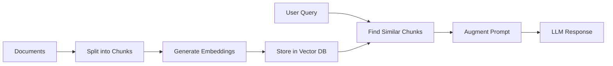

# LangChain4j 1.7.1 Training Course

Building AI-Powered Java Applications

<div class="pt-12">
  <span @click="$slidev.nav.next" class="px-2 py-1 rounded cursor-pointer hover:bg-white hover:bg-opacity-10">
    Press Space for next page <carbon:arrow-right class="inline"/>
  </span>
</div>

---
transition: fade-out
---

# What is LangChain4j?

LangChain4j 1.7.1 is a Java library for building applications with Large Language Models (LLMs)

<div class="grid grid-cols-2 gap-4">

<div>

## Key Features

- 🤖 **AI Model Integration** - OpenAI, Google AI, and more
- 💬 **Chat & Conversations** - With memory management
- 🛠️ **Tool Calling** - Connect AI to your Java methods
- 📚 **RAG Support** - Augment AI with your data
- 🌊 **Streaming** - Real-time AI responses
- 🖼️ **Multimodal** - Process images and audio

</div>

<div>

## Why LangChain4j?

- Native Java integration
- Type-safe builders
- Spring Boot support
- Production-ready
- Active community
- Extensive documentation

</div>

</div>

---
layout: two-cols
---

# What's New in 1.7.1?

Latest enhancements and features

::right::

<div class="space-y-3 text-sm">

<div v-click class="bg-blue-500 bg-opacity-20 p-3 rounded">
<strong>🎯 Class-Based Agents</strong>
<p class="text-xs mt-1">Create agents from classes, not just interfaces</p>
</div>

<div v-click class="bg-green-500 bg-opacity-20 p-3 rounded">
<strong>🗄️ ChromaDB API V2</strong>
<p class="text-xs mt-1">Enhanced vector store with improved performance</p>
</div>

<div v-click class="bg-purple-500 bg-opacity-20 p-3 rounded">
<strong>🐳 Docker MCP Transport</strong>
<p class="text-xs mt-1">Containerized MCP server integration</p>
</div>

<div v-click class="bg-orange-500 bg-opacity-20 p-3 rounded">
<strong>🤖 Enhanced AI Models</strong>
<p class="text-xs mt-1">OpenAI SDK v4.0, Anthropic custom params</p>
</div>

<div v-click class="bg-yellow-500 bg-opacity-20 p-3 rounded">
<strong>📄 New Parsers</strong>
<p class="text-xs mt-1">YAML documents, Oracle loader, GPU support</p>
</div>

<div v-click class="bg-red-500 bg-opacity-20 p-3 rounded">
<strong>⚠️ HuggingFace Deprecated</strong>
<p class="text-xs mt-1">Use OpenAI, Anthropic, or Google AI instead</p>
</div>

</div>

---
layout: two-cols
---

# Simple Chat Example

Basic interaction with OpenAI's GPT model (LangChain4j 1.0+)

::right::

```java {all|3-5|7-9|11|all}
@Test
void simpleQuery() {
    ChatModel model = OpenAiChatModel.builder()
            .apiKey(System.getenv("OPENAI_API_KEY"))
            .modelName(GPT_4_1_NANO)
            .build();
    
    String response = model.chat(
        "What is LangChain4j?"
    );
    
    System.out.println(response);
    assertNotNull(response);
}
```

<div v-after class="text-sm mt-4 text-gray-400">
<p v-click="4">✨ ChatModel interface (LangChain4j 1.0+)</p>
<p v-click="5">✨ Simple chat() method</p>
<p v-click="6">✨ GPT_4_1_NANO constant</p>
</div>

---
layout: two-cols
---

# System Messages

Change AI behavior with system instructions

::right::

```java {all|1-5|7-10|12-16|all}
@Test
void simpleQueryWithSystemMessage() {
    ChatModel model = OpenAiChatModel.builder()
            .apiKey(System.getenv("OPENAI_API_KEY"))
            .modelName(GPT_4_1_NANO)
            .build();

    SystemMessage systemMessage = SystemMessage.from(
        "You are a helpful assistant that responds like a pirate."
    );
    UserMessage userMessage = UserMessage.from("Why is the sky blue?");

    ChatResponse response = model.chat(systemMessage, userMessage);

    System.out.println(response.aiMessage().text());
    assertNotNull(response.aiMessage().text());
}
```

<div v-click class="mt-4 p-3 bg-blue-500 bg-opacity-20 rounded text-sm">
💡 <strong>System messages</strong> control AI personality and behavior
</div>

---
layout: two-cols
---

# Streaming Responses

Real-time AI responses for better user experience

::right::

```java {all|1-5|7-16|18-25|all}
@Test
void streamingChat() throws InterruptedException {
    StreamingChatModel model = OpenAiStreamingChatModel.builder()
            .apiKey(System.getenv("OPENAI_API_KEY"))
            .modelName(GPT_4_1_NANO)
            .build();

    CountDownLatch latch = new CountDownLatch(1);
    StringBuilder fullResponse = new StringBuilder();
    
    model.chat("Tell me a story about a brave robot.", 
        new StreamingChatResponseHandler() {
        @Override
        public void onPartialResponse(String token) {
            System.out.print(token);
            fullResponse.append(token);
        }
        
        @Override
        public void onCompleteResponse(ChatResponse response) {
            System.out.println("\nStreaming completed!");
            latch.countDown();
        }
        
        @Override
        public void onError(Throwable error) {
            System.err.println("Error: " + error.getMessage());
            latch.countDown();
        }
    });
    
    latch.await();
}
```

<div v-click class="mt-4 text-sm text-gray-400">
<p>🌊 Tokens arrive in real-time</p>
<p>⚡ Better perceived performance</p>
<p>🛡️ Built-in error handling</p>
</div>

---
layout: two-cols
---

# AI Services Interface

High-level interfaces with annotations for complex AI interactions

::right::

```java {all|1-6|8-13|15-21|all}
interface FilmographyService {
    @SystemMessage("You are a helpful assistant that provides accurate information about actors and their movies.")
    List<String> getMovies(@UserMessage String actor);
    
    @UserMessage("Generate filmography for {{actorName}} with exactly {{movieCount}} movies")
    ActorFilms getSpecificActorFilmography(
        @V("actorName") String actorName, 
        @V("movieCount") int movieCount
    );
}

// Create the service
ChatModel model = OpenAiChatModel.builder()
        .apiKey(System.getenv("OPENAI_API_KEY"))
        .modelName(GPT_4_1_NANO)
        .build();

FilmographyService service = AiServices.builder(FilmographyService.class)
        .chatModel(model)
        .build();

// Use it
List<String> movies = service.getMovies("Tom Hanks");
```

<div v-click class="mt-4 p-3 bg-green-500 bg-opacity-20 rounded text-sm">
💡 <strong>Templates via annotations:</strong> @SystemMessage, @UserMessage, @V variables
</div>

---
class: px-20
---

# Structured Data Extraction

Extract structured data from unstructured text

```java {1-6|8-14|16-20|all}
// Define your data structure
record Person(
    String name,
    int age,
    String occupation
) {}

// Create extraction interface
interface PersonExtractor {
    @UserMessage("Extract person information from: {{text}}")
    Person extractPerson(@V("text") String text);
}

// Use it
PersonExtractor extractor = AiServices.create(
    PersonExtractor.class, model
);

Person person = extractor.extractPerson(
    "John Doe is a 35-year-old software engineer"
);
```

<div v-click="4" class="mt-4 p-4 bg-blue-500 bg-opacity-20 rounded">
<p class="text-sm">💡 <strong>Result:</strong> Person[name=John Doe, age=35, occupation=software engineer]</p>
</div>

---
layout: image-right
image: https://images.unsplash.com/photo-1633356122544-f134324a6cee?w=920
---

# AI Tools (Function Calling)

Let AI call your Java methods

```java {1-9|11-17|all}
class WeatherTool {
    @Tool("Get current weather")
    String getWeather(String location) {
        // Simulate weather API
        return String.format(
            "Weather in %s: 72°F, sunny", 
            location
        );
    }
}

// Wire it up
var assistant = AiServices.builder(Assistant.class)
    .chatModel(model)
    .tools(new WeatherTool())
    .build();

// AI can now check weather!
String response = assistant.chat(
    "What's the weather in NYC?"
);
```

---

# Chat Memory

Maintain conversation context

<div class="grid grid-cols-2 gap-4">

<div>

```java
// Single user memory
interface Assistant {
    String chat(String message);
}

var assistant = AiServices.builder(Assistant.class)
    .chatModel(model)
    .chatMemory(MessageWindowChatMemory
        .withMaxMessages(10))
    .build();

// Remembers context
assistant.chat("My name is Alice");
assistant.chat("What's my name?");
// Response: "Your name is Alice"
```

</div>

<div>

```java
// Multi-user memory
interface MultiUserAssistant {
    String chat(@MemoryId int userId, 
                @UserMessage String msg);
}

var assistant = AiServices.builder(MultiUserAssistant.class)
    .chatModel(model)
    .chatMemoryProvider(memoryId -> 
        MessageWindowChatMemory
            .withMaxMessages(10))
    .build();

// Separate memory per user
assistant.chat(1, "I'm Alice");
assistant.chat(2, "I'm Bob");
```

</div>

</div>

---
layout: center
class: text-center
---

# Retrieval-Augmented Generation (RAG)



<br>

<div v-click class="text-left inline-block">

**RAG allows AI to access your specific data:**
- 📄 PDFs, Word docs, web pages
- 🔍 Semantic search capabilities  
- 🎯 Context-aware responses
- 💾 Vector stores (Redis, Chroma, etc.)

</div>

---

# RAG Implementation Example

```java {1-10|12-18|20-25|all}
// 1. Set up components
EmbeddingModel embeddingModel = new AllMiniLmL6V2QuantizedEmbeddingModel();
EmbeddingStore<TextSegment> store = new InMemoryEmbeddingStore<>();

// 2. Load and process documents
Document document = FileSystemDocumentLoader.loadDocument(
    Paths.get("knowledge-base.pdf")
);
DocumentSplitter splitter = DocumentSplitters.recursive(300, 50);
List<TextSegment> segments = splitter.split(document);

// 3. Store embeddings
EmbeddingStoreIngestor ingestor = EmbeddingStoreIngestor.builder()
    .documentSplitter(splitter)
    .embeddingModel(embeddingModel)
    .embeddingStore(store)
    .build();
ingestor.ingest(document);

// 4. Create RAG-enabled assistant
Assistant assistant = AiServices.builder(Assistant.class)
    .chatModel(model)
    .contentRetriever(EmbeddingStoreContentRetriever.from(store))
    .build();

String answer = assistant.chat("What does the document say about X?");
```

---
layout: two-cols
---

# ChromaDB Vector Store (API V2)

Production-ready vector database with enhanced performance

::right::

```java {all|1-6|8-14|16-22|all}
// LangChain4j 1.7.1 supports ChromaDB API V2
EmbeddingStore<TextSegment> store = ChromaEmbeddingStore.builder()
    .baseUrl("http://localhost:8000")
    .collectionName(randomUUID())
    .logRequests(true)
    .build();

// Process documents
List<Document> documents = loadDocuments();
DocumentSplitter splitter = DocumentSplitters.recursive(300, 50);
List<TextSegment> segments = splitter.splitAll(documents);

List<Embedding> embeddings = embeddingModel.embedAll(segments).content();
store.addAll(embeddings, segments);

// Query with semantic search
Embedding queryEmbedding = embeddingModel.embed("search query").content();
List<EmbeddingMatch<TextSegment>> matches = store.search(
    EmbeddingSearchRequest.builder()
        .queryEmbedding(queryEmbedding)
        .maxResults(5)
        .build()
).matches();
```

<div v-click class="mt-4 p-3 bg-green-500 bg-opacity-20 rounded text-sm">
🚀 <strong>API V2:</strong> Better performance, newer Chroma versions supported
</div>

---
layout: two-cols
---

# Multimodal: Image Analysis

Process and understand images with AI

::right::

```java {all|1-5|7-14|16-21|all}
// Set up vision-capable model
ChatModel model = OpenAiChatModel.builder()
        .apiKey(System.getenv("OPENAI_API_KEY"))
        .modelName(GPT_4_1_MINI)  // Mini for vision
        .build();

// Load and encode local image
byte[] imageBytes = inputStream.readAllBytes();
String imageString = Base64.getEncoder().encodeToString(imageBytes);

ImageContent imageContent = ImageContent.from(imageString, "image/jpeg");
TextContent textContent = TextContent.from("What do you see in this image?");

// Create multimodal message
UserMessage userMessage = UserMessage.from(textContent, imageContent);

String response = model.chat(userMessage).aiMessage().text();

System.out.println("Image analysis: " + response);
```

<div v-click class="mt-4 p-3 bg-purple-500 bg-opacity-20 rounded text-sm">
🖼️ <strong>Uses GPT_4_1_MINI</strong> for vision capabilities
</div>

---
layout: two-cols
---

# Multimodal: Audio Processing

Speech-to-text capabilities with Google Gemini

::right::

```java {all|1-5|7-12|14-19|all}
// Audio processing with Google Gemini
ChatModel model = GoogleAiGeminiChatModel.builder()
        .apiKey(System.getenv("GOOGLEAI_API_KEY"))
        .modelName("gemini-2.5-flash-preview-05-20")
        .build();

// Process audio input
TextContent textContent = TextContent.from("Please transcribe this audio:");
AudioContent audioContent = AudioContent.from(
    readSimpleAudioData(), // Base64 encoded MP3
    "audio/mp3"
);

// Create multimodal message  
UserMessage userMessage = UserMessage.from(textContent, audioContent);

String transcription = model.chat(userMessage).aiMessage().text();
System.out.println("Transcription: " + transcription);
```

<div v-click class="mt-4 text-sm text-gray-400">
<p>🎵 Supports MP3, WAV, and other formats</p>
<p>🗣️ Great for voice interfaces</p>
<p>⚠️ Requires GOOGLEAI_API_KEY</p>
</div>

---
layout: two-cols
---

# Image Generation

Create images from text descriptions using DALL-E

::right::

```java {all|1-6|8-14|16-21|all}
// Set up DALL-E image model
ImageModel imageModel = OpenAiImageModel.builder()
        .apiKey(System.getenv("OPENAI_API_KEY"))
        .modelName(DALL_E_3)
        .quality("hd")
        .build();

// Generate image from prompt
Response<Image> response = imageModel.generate(
    "A coffee cup on a wooden desk with morning sunlight, " +
    "photorealistic style, high quality"
);

// Get the generated image
Image generatedImage = response.content();
String imageUrl = generatedImage.url();
System.out.println("Generated image: " + imageUrl);

// Can also get as Base64 data
byte[] imageData = generatedImage.base64Data();
```

<div v-click class="mt-4 p-3 bg-pink-500 bg-opacity-20 rounded text-sm">
🎨 <strong>Uses DALL_E_3 constant</strong> for latest model
</div>

---
layout: two-cols
---

# MCP Integration

Model Context Protocol for external tool integration

::right::

```java {all|1-7|9-15|17-25|all}
// Option 1: stdio transport (npx)
McpTransport transport = new StdioMcpTransport.Builder()
    .command(List.of("npx", "-y",
        "@modelcontextprotocol/server-everything"))
    .build();

McpClient mcpClient = new DefaultMcpClient.Builder()
    .transport(transport)
    .build();

// Option 2: NEW in 1.7.1 - Docker transport
McpTransport dockerTransport = new DockerMcpTransport.Builder()
    .image("mcp-server:latest")
    .build();

McpClient dockerClient = new DefaultMcpClient.Builder()
    .transport(dockerTransport)
    .build();

// Create MCP tool provider
McpToolProvider toolProvider = McpToolProvider.builder()
    .mcpClients(mcpClient)
    .build();

// Use with AI services
Assistant assistant = AiServices.builder(Assistant.class)
    .chatModel(model)
    .toolProvider(toolProvider)
    .build();
```

<div v-click class="mt-4 p-3 bg-purple-500 bg-opacity-20 rounded text-sm">
🐳 <strong>1.7.1 NEW:</strong> Docker transport for containerized MCP servers
</div>

---
layout: two-cols
---

# Production Considerations

Real-world deployment best practices (LangChain4j 1.7.1)

::right::

```java {all|1-8|10-16|18-25|all}
// Error handling and retries
ChatModel model = OpenAiChatModel.builder()
        .apiKey(System.getenv("OPENAI_API_KEY"))
        .modelName(GPT_4_1_NANO)
        .maxRetries(3)
        .logRequests(true)
        .logResponses(true)
        .build();

// Token usage monitoring
ChatResponse response = model.chat("Hello");
TokenUsage usage = response.tokenUsage();
System.out.println("Input tokens: " + usage.inputTokenCount());
System.out.println("Output tokens: " + usage.outputTokenCount());
System.out.println("Total cost: $" +
    calculateCost(usage.totalTokenCount()));

// Vector stores: ChromaDB (API V2 in 1.7.1)
EmbeddingStore<TextSegment> store = ChromaEmbeddingStore.builder()
    .baseUrl("http://localhost:8000")
    .collectionName("production-embeddings")
    .dimension(384) // Match your embedding model
    .build();
```

<div v-click class="mt-4 p-3 bg-red-500 bg-opacity-20 rounded text-sm">
⚠️ <strong>Security:</strong> Never log API keys, validate inputs, rate limit
</div>

<div v-click class="mt-2 p-3 bg-yellow-500 bg-opacity-20 rounded text-sm">
⚠️ <strong>Deprecated:</strong> HuggingFace models - use OpenAI/Anthropic/Google AI
</div>

---
layout: fact
---

# Complete Lab Progression

10 hands-on labs covering all LangChain4j capabilities

<div class="grid grid-cols-2 gap-6 mt-8 text-sm">

<div v-click class="space-y-3">
<div class="bg-blue-500 bg-opacity-20 p-3 rounded">
<h4 class="font-bold mb-2">🚀 Foundation (Labs 1-3)</h4>
<ul class="space-y-1">
<li>• Lab 1: Basic Chat Interactions</li>
<li>• Lab 2: Streaming Responses</li>
<li>• Lab 3: Structured Data Extraction</li>
</ul>
</div>

<div class="bg-green-500 bg-opacity-20 p-3 rounded">
<h4 class="font-bold mb-2">🧠 Services & Memory (Labs 4-5)</h4>
<ul class="space-y-1">
<li>• Lab 4: AI Services Interface</li>
<li>• Lab 5: Chat Memory</li>
</ul>
</div>
</div>

<div v-click class="space-y-3">
<div class="bg-purple-500 bg-opacity-20 p-3 rounded">
<h4 class="font-bold mb-2">🛠️ Tools & Integration (Labs 6-8)</h4>
<ul class="space-y-1">
<li>• Lab 6: AI Tools (Function Calling)</li>
<li>• Lab 6.5: MCP Integration</li>
<li>• Lab 7: Multimodal (Vision & Audio)</li>
<li>• Lab 8: Image Generation</li>
</ul>
</div>

<div class="bg-orange-500 bg-opacity-20 p-3 rounded">
<h4 class="font-bold mb-2">📚 RAG Implementation (Labs 9-10)</h4>
<ul class="space-y-1">
<li>• Lab 9: Retrieval-Augmented Generation</li>
<li>• Lab 10: Chroma Vector Store for RAG</li>
</ul>
</div>
</div>

</div>

---
layout: two-cols
---

# Resources

<div class="mt-8">

## 📚 Documentation
- [LangChain4j Docs](https://docs.langchain4j.dev)
- [GitHub Repository](https://github.com/langchain4j/langchain4j)
- [Examples](https://github.com/langchain4j/langchain4j-examples)

## 🛠️ This Course (v1.7.1)
- Main branch: Starter code
- Solutions branch: Complete implementations
- Labs.md: Step-by-step guide
- UPGRADE_NOTES_1.7.1.md: What's new

</div>

::right::

<div class="mt-8">

## 🎯 Best Practices
- Use environment variables for API keys
- Implement proper error handling
- Monitor token usage
- Cache embeddings when possible
- Test with different models
- Use ChromaDB API V2 for production

## 💡 Tips
- Start simple, iterate
- Read the JavaDocs
- Check the examples repo
- Join the community
- Explore class-based agents (1.7.1)
- Try Docker MCP transport

</div>

---
layout: center
class: text-center
---

# Ready to Build with AI? 🚀

Let's start with Lab 1: Basic Chat Interactions

<div class="mt-8">
<span @click="$slidev.nav.go(1)" class="px-4 py-2 rounded cursor-pointer bg-blue-500" hover="bg-blue-400">
  Back to start <carbon:arrow-left class="inline"/>
</span>
</div>

---
layout: end
---

# Thank You!

Questions?

---
layout: two-cols
---

# Contact Info

**Ken Kousen** | Kousen IT, Inc.

📧 [ken.kousen@kousenit.com](mailto:ken.kousen@kousenit.com)  
🌐 [www.kousenit.com](http://www.kousenit.com)  
📝 [kousenit.org](https://kousenit.org) (blog)  
💼 [linkedin.com/in/kenkousen](https://www.linkedin.com/in/kenkousen/)  
🐦 [@kenkousen](https://twitter.com/kenkousen)  
🐘 [foojay.social/@kenkousen](https://foojay.social/@kenkousen)  
💙 [bsky.app/profile/kousenit.com](https://bsky.app/profile/kousenit.com)  

**📰 Tales from the jar side**  
[kenkousen.substack.com](https://kenkousen.substack.com)  
[youtube.com/@talesfromthejarside](https://youtube.com/@talesfromthejarside)

::right::

### Published Books

**O'REILLY MEDIA**
- Kotlin Cookbook
- Modern Java Recipes
- Gradle Recipes for Android

**MANNING**
- Making Java Groovy

**PRAGMATIC BOOKSHELF**
- Help Your Boss Help You
- Mockito Made Clear