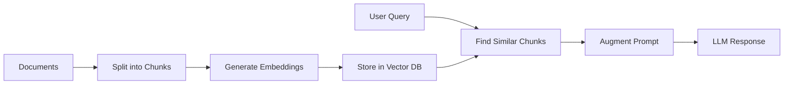
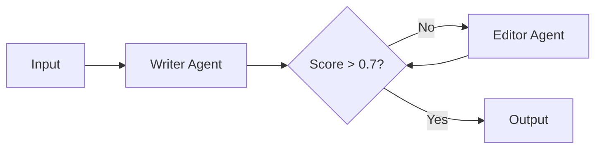

# LangChain4j Training Course

Building AI-Powered Java Applications

<div class="pt-12">
  <span @click="$slidev.nav.next" class="px-2 py-1 rounded cursor-pointer hover:bg-white hover:bg-opacity-10">
    Press Space for next page <carbon:arrow-right class="inline"/>
  </span>
</div>

---
transition: fade-out
---

# What is LangChain4j?

A Java library for building applications with Large Language Models (LLMs)

<div class="grid grid-cols-2 gap-4">

<div>

## Key Features

- 🤖 **Model Integration** - OpenAI, Anthropic, Google AI, and more
- 💬 **Chat & Memory** - With conversation context
- 🛠️ **Tool Calling** - Connect AI to your Java methods
- 🤝 **Agentic API** - Compose agents into workflows
- 📚 **RAG Support** - Augment AI with your data
- 🌊 **Streaming** - Real-time responses, with cancellation
- 🖼️ **Multimodal** - Images, audio (transcription), video
- 🔌 **MCP Client** - External tools via Model Context Protocol

</div>

<div>

## Why LangChain4j?

- Native Java integration
- Type-safe builders
- Spring Boot support
- Production-ready
- Active community
- Extensive documentation

</div>

</div>

---
layout: two-cols
---

# Simple Chat Example

Basic interaction with OpenAI's GPT model

::right::

```java {all|3-5|7-9|11|all}
@Test
void simpleQuery() {
    ChatModel model = OpenAiChatModel.builder()
            .apiKey(System.getenv("OPENAI_API_KEY"))
            .modelName(GPT_4_1_NANO)
            .build();

    String response = model.chat(
        "What is LangChain4j?"
    );

    System.out.println(response);
    assertNotNull(response);
}
```

<div v-after class="text-sm mt-4 text-gray-400">
<p v-click="4">✨ ChatModel interface</p>
<p v-click="5">✨ Simple chat() method</p>
<p v-click="6">✨ GPT_4_1_NANO constant</p>
</div>

---
layout: two-cols
---

# System Messages

Change AI behavior with system instructions

::right::

```java {all|1-5|7-10|12-16|all}
@Test
void simpleQueryWithSystemMessage() {
    ChatModel model = OpenAiChatModel.builder()
            .apiKey(System.getenv("OPENAI_API_KEY"))
            .modelName(GPT_4_1_NANO)
            .build();

    SystemMessage systemMessage = SystemMessage.from(
        "You are a helpful assistant that responds like a pirate."
    );
    UserMessage userMessage = UserMessage.from("Why is the sky blue?");

    ChatResponse response = model.chat(systemMessage, userMessage);

    System.out.println(response.aiMessage().text());
    assertNotNull(response.aiMessage().text());
}
```

<div v-click class="mt-4 p-3 bg-blue-500 bg-opacity-20 rounded text-sm">
💡 <strong>System messages</strong> control AI personality and behavior
</div>

---
layout: two-cols
---

# Streaming Responses

Real-time AI responses for better user experience

::right::

```java {all|1-4|6-10|all}
@Test
void streamingChat() {
    StreamingChatModel model = OpenAiStreamingChatModel
        .builder()
        .apiKey(System.getenv("OPENAI_API_KEY"))
        .build();

    model.chat("Tell me a story",
        new StreamingChatResponseHandler() {
            public void onPartialResponse(String token) {
                System.out.print(token);
            }
            public void onCompleteResponse(ChatResponse r) {
                System.out.println("\nDone!");
            }
        });
}
```

<div v-click class="mt-4 text-sm text-gray-400">
<p>🌊 Real-time tokens</p>
<p>⚡ Better UX</p>
</div>

---
layout: two-cols
---

# AI Services Interface

High-level type-safe AI interactions

::right::

```java {all|1-4|6-10|all}
interface FilmographyService {
    @SystemMessage("Movie expert")
    List<String> getMovies(
        @UserMessage String actor);
}

FilmographyService service =
    AiServices.builder(FilmographyService.class)
        .chatModel(model)
        .build();

List<String> movies = service.getMovies("Tom Hanks");
```

<div v-click class="mt-4 text-sm text-gray-400">
<p>✨ Type-safe interfaces</p>
<p>✨ Annotation-driven</p>
</div>

---
class: px-20
---

# Structured Data Extraction

Type-safe data parsing

```java {1-4|6-10|all}
record Person(String name, int age, String occupation) {}

interface PersonExtractor {
    @UserMessage("Extract: {{text}}")
    Person extractPerson(@V("text") String text);
}

PersonExtractor ex = AiServices.create(
    PersonExtractor.class, model);

Person p = ex.extractPerson(
    "John Doe is a 35-year-old engineer");
```

<div v-click class="mt-4 text-sm text-gray-400">
<p>💡 Returns: Person[name=John Doe, age=35, ...]</p>
</div>

---
layout: image-right
image: https://images.unsplash.com/photo-1633356122544-f134324a6cee?w=920
---

# AI Tools (Function Calling)

Let AI call your Java methods

```java {1-6|8-12|all}
class WeatherTool {
    @Tool("Get current weather")
    String getWeather(String location) {
        return "Weather in " + location +
               ": 72°F, sunny";
    }
}

var assistant = AiServices.builder(Assistant.class)
    .chatModel(model)
    .tools(new WeatherTool())
    .build();

assistant.chat("What's the weather in NYC?");
```

---
layout: two-cols
---

# Optional Tool Parameters

Two ways to make a parameter optional

::right::

```java {all|1-4|6-10|all}
// Option A: Optional<T> (1.12+)
// — absence is meaningful business logic
@Tool("Weather; units default to metric")
String getWeather(String city, Optional<String> units);

// Option B: @P(defaultValue = ...) (1.15+)
// — tool has a sensible fallback
@Tool("Search articles")
String searchArticles(String query,
    @P(defaultValue = "10") int limit,
    @P(defaultValue = "RELEVANCE") SortBy sortBy,
    @P(defaultValue = "[\"en\"]") List<String> languages);
```

<div v-click class="mt-4 text-sm text-gray-400">
<p>💡 Defaults are parsed at registration — typos fail fast, not on first call</p>
</div>

---
layout: two-cols
---

# Chat Memory

Single user conversation

::right::

```java {all|1-3|5-9|all}
interface Assistant {
    String chat(String message);
}

var assistant = AiServices.builder(Assistant.class)
    .chatModel(model)
    .chatMemory(MessageWindowChatMemory
        .withMaxMessages(10))
    .build();

assistant.chat("My name is Alice");
assistant.chat("What's my name?");
// Response: "Your name is Alice"
```

---
layout: two-cols
---

# Chat Memory

Multi-user conversations

::right::

```java {all|1-4|6-10|all}
interface MultiUserAssistant {
    String chat(@MemoryId int userId,
                @UserMessage String msg);
}

var assistant = AiServices.builder(...)
    .chatMemoryProvider(memoryId ->
        MessageWindowChatMemory
            .withMaxMessages(10))
    .build();

assistant.chat(1, "I'm Alice");
assistant.chat(2, "I'm Bob");
```

---
layout: center
class: text-center
---

# Retrieval-Augmented Generation (RAG)


```mermaid
graph LR
    A[Documents] --> B[Split into Chunks]
    B --> C[Generate Embeddings]
    C --> D[Store in Vector DB]
    E[User Query] --> F[Find Similar Chunks]
    D --> F
    F --> G[Augment Prompt]
    G --> H[LLM Response]
```

<br>

<div v-click class="text-left inline-block">

**RAG allows AI to access your specific data:**
- 📄 PDFs, Word docs, web pages
- 🔍 Semantic search capabilities
- 🎯 Context-aware responses
- 💾 Vector stores (Redis, Chroma, etc.)

</div>

---

# RAG Implementation

```java {1-4|6-10|12-16|all}
// Setup embedding model and store
EmbeddingModel embeddingModel =
    new AllMiniLmL6V2QuantizedEmbeddingModel();
EmbeddingStore<TextSegment> store =
    new InMemoryEmbeddingStore<>();

// Load and split documents
Document doc = FileSystemDocumentLoader.loadDocument(
    Paths.get("knowledge-base.pdf"));
List<TextSegment> segments =
    DocumentSplitters.recursive(300, 50).split(doc);

// Create RAG assistant
Assistant assistant = AiServices.builder(Assistant.class)
    .chatModel(model)
    .contentRetriever(
        EmbeddingStoreContentRetriever.from(store))
    .build();
```

---
layout: two-cols
---

# ChromaDB

Production vector store

::right::

```java {all|1-4|6-9|11-14|all}
// ChromaDB API V2 client
EmbeddingStore<TextSegment> store =
    ChromaEmbeddingStore.builder()
        .baseUrl("http://localhost:8000")
        .collectionName(randomUUID())
        .build();

// Process and store
List<TextSegment> segments = splitDocuments(docs);
List<Embedding> embeddings =
    embeddingModel.embedAll(segments).content();
store.addAll(embeddings, segments);

// Semantic search
List<EmbeddingMatch<TextSegment>> matches =
    store.search(EmbeddingSearchRequest.builder()
        .queryEmbedding(queryEmbedding)
        .maxResults(5).build()).matches();
```

<div v-click class="mt-2 text-sm text-gray-400">
<p>🚀 Chroma teaches pure-vector search; PgVector & Elasticsearch add hybrid search</p>
</div>

---
layout: two-cols
---

# Multimodal: Images

Process images with AI

::right::

```java {all|1-3|5-9|all}
// Vision model
ChatModel model = OpenAiChatModel.builder()
    .modelName(GPT_5_1)
    .build();

// Analyze image
ImageContent img = ImageContent.from(imageString, "image/jpeg");
TextContent txt = TextContent.from("What do you see?");
UserMessage msg = UserMessage.from(txt, img);

String response = model.chat(msg).aiMessage().text();
```

<div v-click class="mt-2 text-sm text-gray-400">
<p>🖼️ GPT-5.1 for vision</p>
</div>

---
layout: two-cols
---

# Multimodal: Audio

Speech-to-text with OpenAI's transcription model

::right::

```java {all|1-4|6-9|11-13|all}
// Dedicated transcription model
OpenAiAudioTranscriptionModel transcribe =
    OpenAiAudioTranscriptionModel.builder()
        .apiKey(System.getenv("OPENAI_API_KEY"))
        .modelName("gpt-4o-transcribe")
        .build();

Audio audio = Audio.builder()
    .binaryData(audioBytes)
    .mimeType("audio/mp3")
    .build();

AudioTranscriptionResponse response =
    transcribe.transcribe(
        AudioTranscriptionRequest.builder()
            .audio(audio).build());

String transcript = response.text();
```

<div v-click class="mt-2 text-sm text-gray-400">
<p>🎵 whisper-1, gpt-4o-transcribe, gpt-4o-transcribe-diarize</p>
</div>

---
layout: two-cols
---

# Image Generation

Create images with gpt-image-2

::right::

```java {all|1-4|6-9|11-13|all}
// gpt-image-2 model
ImageModel imageModel = OpenAiImageModel.builder()
    .apiKey(System.getenv("OPENAI_API_KEY"))
    .modelName("gpt-image-2")
    .quality("high") // low | medium | high | auto
    .build();

// Generate from prompt
Response<Image> response = imageModel.generate(
    "A coffee cup on a desk, photorealistic");

// GPT Image returns base64, not a URL
byte[] bytes = Base64.getDecoder().decode(
    response.content().base64Data());
```

<div v-click class="mt-2 text-sm text-gray-400">
<p>🎨 DALL-E 3 was deprecated 2026-05-12; GPT Image models are the replacement</p>
</div>

---
layout: two-cols
---

# MCP Integration

External tool protocol

::right::

```java {all|1-5|7-11|all}
// MCP client (stdio)
McpTransport transport =
    new StdioMcpTransport.Builder()
        .command(List.of("npx", "-y",
            "@modelcontextprotocol/server-everything",
            "stdio"))
        .build();

// Use with AI
McpToolProvider tools = McpToolProvider.builder()
    .mcpClients(new DefaultMcpClient.Builder()
        .transport(transport).build())
    .build();

Assistant ai = AiServices.builder(Assistant.class)
    .toolProvider(tools).build();
```

<div v-click class="mt-2 text-sm text-gray-400">
<p>🚇 Standard: stdio + Streamable HTTP; LangChain4j also supports Docker stdio + WebSocket</p>
</div>

---
layout: center
class: text-center
---

# Agentic API

Compose multiple LLM-backed agents into workflows


```mermaid
graph LR
    A[Input] --> B[Writer Agent]
    B --> C{Score &gt; 0.7?}
    C -->|No| D[Editor Agent]
    D --> C
    C -->|Yes| E[Output]
```

<div v-click class="text-left inline-block mt-4">

The `langchain4j-agentic` module composes agents into:

- **Sequence** — fan-in: writer → editor → publisher
- **Loop** — iterate until exit condition met
- **Parallel** — fan-out and merge
- **Conditional** — branch on shared state
- **Supervisor** — LLM picks the next sub-agent

</div>

---
layout: two-cols
---

# Defining an Agent

`@Agent` annotation + `AgenticServices.agentBuilder`

::right::

```java {all|1-7|9-12|all}
interface CreativeWriter {
    @SystemMessage("You write short stories.")
    @UserMessage("Write a story about {{topic}}.")
    @Agent("Generate a short story")
    String writeStoryAbout(
        @V("topic") String topic);
}

CreativeWriter writer =
    AgenticServices.agentBuilder(CreativeWriter.class)
        .chatModel(model)
        .outputKey("story")
        .build();

String story = writer.writeStoryAbout("dragons");
```

<div v-click class="mt-4 text-sm text-gray-400">
<p>💡 outputKey publishes results to a shared AgenticScope</p>
</div>

---
layout: two-cols
---

# Composing Agents

Build a sequence or a loop

::right::

```java {all|1-5|7-12|all}
// Sequence: writer then editor
UntypedAgent novelist =
    AgenticServices.sequenceBuilder()
        .subAgents(writer, editor)
        .outputKey("story")
        .build();

// Loop: edit until score >= 0.7
UntypedAgent reviewLoop =
    AgenticServices.loopBuilder()
        .subAgents(scorer, styleEditor)
        .maxIterations(3)
        .exitCondition(scope ->
            scope.readState("score", 0.0) >= 0.7)
        .build();

Object result = novelist.invoke(
    Map.of("topic", "lighthouse keeper"));
```

<div v-click class="mt-4 text-sm text-gray-400">
<p>🤝 Each agent reads/writes the shared scope by key</p>
</div>

---
layout: two-cols
---

# Voting Pattern (1.15+)

`langchain4j-agentic-patterns` — fan out, then aggregate

::right::

```java {all|1-9|11-15|all}
// Three classifiers, three temperatures = diversity
SentimentClassifier c1 = AgenticServices
    .agentBuilder(SentimentClassifier.class)
    .chatModel(coldModel).outputKey("vote1").build();
SentimentClassifier c2 = AgenticServices
    .agentBuilder(SentimentClassifier.class)
    .chatModel(warmModel).outputKey("vote2").build();
SentimentClassifier c3 = AgenticServices
    .agentBuilder(SentimentClassifier.class)
    .chatModel(hotModel).outputKey("vote3").build();

SentimentVoter voter = AgenticServices
    .plannerBuilder(SentimentVoter.class)
    .subAgents(c1, c2, c3)
    .planner(VotingPlanner::new)  // default: majority
    .outputKey("classification").build();

String result = voter.classify("I love this!");
// -> "POSITIVE"
```

<div v-click class="mt-4 text-sm text-gray-400">
<p>🗳️ Pass a custom VotingStrategy lambda to average scores, weight votes, etc.</p>
</div>

---
layout: two-cols
---

# Production Considerations

Real-world deployment best practices

::right::

```java {all|1-8|10-16|18-25|all}
// Error handling and retries
ChatModel model = OpenAiChatModel.builder()
        .apiKey(System.getenv("OPENAI_API_KEY"))
        .modelName(GPT_4_1_NANO)
        .maxRetries(3)
        .logRequests(true)
        .logResponses(true)
        .build();

// Token usage monitoring
ChatResponse response = model.chat("Hello");
TokenUsage usage = response.tokenUsage();
System.out.println("Input tokens: " + usage.inputTokenCount());
System.out.println("Output tokens: " + usage.outputTokenCount());
System.out.println("Total cost: $" +
    calculateCost(usage.totalTokenCount()));

// Vector store: Chroma shown here for pure vector search
EmbeddingStore<TextSegment> store = ChromaEmbeddingStore.builder()
    .baseUrl("http://localhost:8000")
    .collectionName("production-embeddings")
    .dimension(384) // Match your embedding model
    .build();
```

<div v-click class="mt-4 p-3 bg-red-500 bg-opacity-20 rounded text-sm">
⚠️ <strong>Security:</strong> Never log API keys, validate inputs, rate limit
</div>

<div v-click class="mt-2 p-3 bg-blue-500 bg-opacity-20 rounded text-sm">
📊 <strong>Observability:</strong> Micrometer metrics + Observation API (1.12)
</div>

---
layout: two-cols
---

# Lab Progression

11 hands-on labs

::right::

<div class="space-y-3 text-sm mt-4">

<div v-click class="bg-blue-500 bg-opacity-20 p-2 rounded">
<strong>🚀 Foundation</strong>
<p class="text-xs">Labs 1-3: Chat, Streaming, Extraction</p>
</div>

<div v-click class="bg-green-500 bg-opacity-20 p-2 rounded">
<strong>🧠 Services & Memory</strong>
<p class="text-xs">Labs 4-5: AI Services, Chat Memory</p>
</div>

<div v-click class="bg-purple-500 bg-opacity-20 p-2 rounded">
<strong>🛠️ Tools & Integration</strong>
<p class="text-xs">Labs 6, 6.8, 7-8: Function Calling, MCP, Multimodal, Image Gen</p>
</div>

<div v-click class="bg-orange-500 bg-opacity-20 p-2 rounded">
<strong>📚 RAG Implementation</strong>
<p class="text-xs">Labs 9-10: RAG, Vector Stores</p>
</div>

<div v-click class="bg-pink-500 bg-opacity-20 p-2 rounded">
<strong>🤝 Agentic Workflows</strong>
<p class="text-xs">Lab 11: Sequence, Loop, Voting</p>
</div>

</div>

---
layout: two-cols
---

# Resources

Documentation and course materials

::right::

<div class="mt-4 space-y-4 text-sm">

<div v-click class="bg-blue-500 bg-opacity-20 p-3 rounded">
<strong>📚 Documentation</strong>
<ul class="text-xs mt-1 space-y-1">
<li>• [LangChain4j Docs](https://docs.langchain4j.dev)</li>
<li>• [GitHub Repository](https://github.com/langchain4j/langchain4j)</li>
<li>• [Examples](https://github.com/langchain4j/langchain4j-examples)</li>
</ul>
</div>

<div v-click class="bg-green-500 bg-opacity-20 p-3 rounded">
<strong>🛠️ This Course</strong>
<ul class="text-xs mt-1 space-y-1">
<li>• Main branch: Starter code</li>
<li>• Solutions branch: Complete implementations</li>
<li>• Labs.md: Step-by-step guide</li>
<li>• Pinned to LangChain4j 1.15.0</li>
</ul>
</div>

</div>

---
layout: two-cols
---

# Best Practices

Tips for production use

::right::

<div class="mt-4 space-y-4 text-sm">

<div v-click class="bg-purple-500 bg-opacity-20 p-3 rounded">
<strong>🎯 Best Practices</strong>
<ul class="text-xs mt-1 space-y-1">
<li>• Use environment variables for API keys</li>
<li>• Implement proper error handling</li>
<li>• Monitor token usage and add Micrometer metrics</li>
<li>• Cache embeddings when possible</li>
<li>• Test with different models</li>
<li>• Use hybrid search when lexical recall matters</li>
</ul>
</div>

<div v-click class="bg-orange-500 bg-opacity-20 p-3 rounded">
<strong>💡 Tips</strong>
<ul class="text-xs mt-1 space-y-1">
<li>• Start simple, iterate</li>
<li>• Read the JavaDocs</li>
<li>• Check the examples repo</li>
<li>• Join the community</li>
<li>• Explore the agentic API for multi-step workflows</li>
<li>• Use the Observation API for tracing</li>
</ul>
</div>

</div>

---
layout: center
class: text-center
---

# Ready to Build with AI? 🚀

Let's start with Lab 1: Basic Chat Interactions

<div class="mt-8">
<span @click="$slidev.nav.go(1)" class="px-4 py-2 rounded cursor-pointer bg-blue-500" hover="bg-blue-400">
  Back to start <carbon:arrow-left class="inline"/>
</span>
</div>

---
layout: end
---

# Thank You!

Questions?

---
layout: two-cols
---

# Contact Info

**Ken Kousen** | Kousen IT, Inc.

📧 [ken.kousen@kousenit.com](mailto:ken.kousen@kousenit.com)<br>
🌐 [www.kousenit.com](http://www.kousenit.com)<br>
📝 [kousenit.org](https://kousenit.org) (blog)<br>
💼 [linkedin.com/in/kenkousen](https://www.linkedin.com/in/kenkousen/)<br>
🐦 [@kenkousen](https://twitter.com/kenkousen)<br>
🐘 [foojay.social/@kenkousen](https://foojay.social/@kenkousen)<br>
💙 [bsky.app/profile/kousenit.com](https://bsky.app/profile/kousenit.com)<br>

**📰 Tales from the jar side**<br>
[kenkousen.substack.com](https://kenkousen.substack.com)<br>
[youtube.com/@talesfromthejarside](https://youtube.com/@talesfromthejarside)

::right::

### Published Books

**O'REILLY MEDIA**
- Kotlin Cookbook
- Modern Java Recipes
- Gradle Recipes for Android

**MANNING**
- Making Java Groovy

**PRAGMATIC BOOKSHELF**
- Help Your Boss Help You
- Mockito Made Clear
